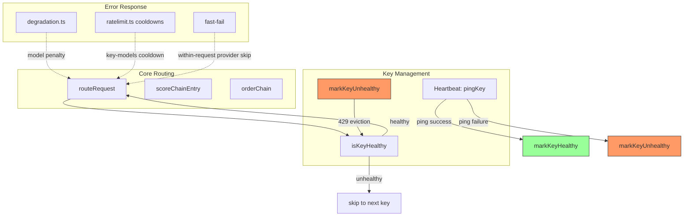

# 429 Key Exclusion — Design Document

## 1. Architecture Overview

429 Key Exclusion is a **minimal, targeted addition** to the existing per-key health system. It adds exactly one new call site — `markKeyUnhealthy(keyId)` in the proxy's retry loop — and one new exported function in `heartbeat.ts`. The router, degradation engine, cooldown system, and exhaustion tracker are all **unchanged**.

### Integration with Existing Systems

| System | Role | Unchanged? |
|---|---|---|
| **Router** (`router.ts`) | `isKeyHealthy()` already filters out unhealthy keys when heartbeat is enabled | ✅ No change |
| **Heartbeat** (`heartbeat.ts`) | Gains `markKeyUnhealthy()` export; recovery path unchanged | ✅ Trivial addition |
| **Degradation** (`degradation.ts`) | `recordFailure('minor')` still fires for 429s — model-level penalty accumulates | ✅ No change |
| **Cooldown** (`ratelimit.ts`) | `setCooldown()` still runs as safety-net for non-heartbeat deployments | ✅ No change |
| **Key Exhaustion** (`key-exhaustion.ts`) | `markExhausted()` still runs — prevents re-selection within same request | ✅ No change |
| **Fast-Fail** (`provider-outage-fast-fail`) | 429s are `'minor'` — don't trigger fast-fail (correct: 429 ≠ outage) | ✅ No change |
| **Proxy** (`proxy.ts`) | Gains eviction check + event emission after key exhaustion block | 📝 One new block |

```mermaid
flowchart TD
    A[Request → key returns 429] --> B{classifyError === 'minor'?}
    B -->|Yes| C{isHeartbeatEnabled?}
    C -->|Yes| D[markKeyUnhealthy — key excluded from healthy pool]
    D --> E[publish routing.key_evicted]
    E --> F[break keyRetry — skip remaining retries]
    F --> G[Fall through to normal key exhaustion block]
    G --> H[markExhausted + setCooldown + recordFailure]
    H --> I[Continue outer loop — routeRequest picks another key]

    C -->|No| J[Normal flow: retry / exhaust / cooldown]
    B -->|No (5xx/401/403)| J
```

### Recovery Path

```mermaid
flowchart LR
    subgraph "During Request Traffic"
        A[Key healthy] -->|429| B[Key unhealthy (evicted)]
    end

    subgraph "Heartbeat Cycle"
        C[Heartbeat pings key] -->|Success| D[Key healthy again]
        C -->|429/5xx| E[Stays unhealthy]
    end

    B -.-> C
    D -.-> A
    E -.-> C
```

---

## 2. Core Data Model

### 2.1 No New Data Structures

The existing `KeyHealth` interface in `heartbeat.ts` is sufficient:

```typescript
interface KeyHealth {
  penalty: number;      // Incremented on failure, reset on success
  lastPingAt: number;   // Updated on every health transition
  healthy: boolean;     // false = excluded from routing
  lastError?: string;   // Human-readable reason for dashboard/debug
}
```

A key's `healthy` field is set to `false` by:
- `markKeyUnhealthy(keyId)` — called from proxy on 429/402 (NEW)
- `pingKey()` catch block — heartbeat ping failure (existing)
- `pingKey()` decrypt failure (existing)

A key's `healthy` field is set to `true` only by:
- `pingKey()` success block — heartbeat ping success (existing)

### 2.2 No New DB Columns

Everything stays in-memory in `keyHealthMap`. On restart:
- `keyHealthMap` is empty
- `isKeyHealthy(keyId)` returns `false` for unknown keys when heartbeat is enabled
- The startup prewarm cycle (`runCycle(true)`) re-pings all keys

---

## 3. Algorithm Details

### 3.1 `markKeyUnhealthy(keyId)`

```typescript
export function markKeyUnhealthy(keyId: number, error?: string): void {
  if (!isHeartbeatEnabled()) return;
  const prev = keyHealthMap.get(keyId);
  keyHealthMap.set(keyId, {
    penalty: (prev?.penalty ?? 0) + 1,
    lastPingAt: Date.now(),
    healthy: false,
    lastError: error ?? 'evicted by traffic 429',
  });
}
```

Key decisions:
- **`penalty` increments, not resets** — preserves the cumulative failure count for dashboard visibility. The heartbeat's success path resets penalty to 0.
- **Healthy heartbeat check** — `!isHeartbeatEnabled()` guards the no-op. This is read at call time (not cached), so if the feature setting changes (it's `restart`-effect, so it won't change mid-runtime, but defensive).
- **`error` parameter** — allows the caller to provide a meaningful reason (e.g. "429 rate limit" or "402 payment required") that shows up in `getAllKeyHealth()`.

### 3.2 Proxy Integration Point

**File**: `server/src/routes/proxy.ts`
**Location**: Inside the retry catch block, before `continue keyRetry (L1228)` and `break keyRetry (L1232)`.

Current code (simplified):
```typescript
if (isRetryableError(err)) {
  if (keyAttempt < PER_KEY_RETRIES - 1) {
    lastError = err;
    publish({ type: 'routing.key_retry', ... });
    continue keyRetry;
  }
  lastError = err;
  break keyRetry;
} else {
  // Non-retryable → 502
}
```

New code:
```typescript
if (isRetryableError(err)) {
  // ── 429/402 key eviction ──
  if (classifyError(err) === 'minor' && isHeartbeatEnabled()) {
    markKeyUnhealthy(route.keyId, err.message?.slice(0, 120) ?? '429 rate limit');
    publish({
      type: 'routing.key_evicted',
      id: requestId,
      provider: route.platform,
      keyId: route.keyId,
      model: route.modelId,
      reason: 'rate_limited',  // 402 → 'payment_required'
      at: Date.now(),
    });
    // Don't waste remaining retries on an evicted key.
    // Fall through to key exhaustion block below.
    break keyRetry;
  }

  if (keyAttempt < PER_KEY_RETRIES - 1) {
    lastError = err;
    publish({ type: 'routing.key_retry', ... });
    continue keyRetry;
  }
  lastError = err;
  break keyRetry;
} else {
  // Non-retryable → 502
}
```

After `break keyRetry`, the existing key exhaustion block runs (`markExhausted`, `setCooldown`, `recordFailure`, fast-fail check) — unchanged.

**Why break, not continue?** `break keyRetry` exits the per-key retry loop, immediately falling through to the key exhaustion block. `continue` would skip the rest of this iteration but loop back for another retry attempt — the opposite of what we want (don't retry an evicted key).

### 3.3 Determining `reason`

The reason field on the event (`'rate_limited' | 'payment_required'`) is determined by the specific error:

```typescript
const reason = isPaymentRequiredError(err) ? 'payment_required' : 'rate_limited';
```

`isPaymentRequiredError(err)` is already exported from `proxy.ts` and checks for the "402" / "payment required" pattern. All other retryable-minor errors (429, quota, resource exhausted) are classified as `'rate_limited'`.

### 3.4 Interaction with Heartbeat's Existing Unhealthy Logic

The heartbeat's `pingKey()` already handles marking keys unhealthy on ping failure:

```typescript
// In pingKey() catch block (existing):
if (!isModelError) {
  keyHealthMap.set(keyRow.id, {
    penalty: newPenalty,
    lastPingAt: Date.now(),
    healthy: false,
    lastError: (err?.message ?? 'unknown').slice(0, 120),
  });
}
```

This continues to work correctly:
- A key evicted by traffic 429 stays unhealthy until heartbeat pings it
- Heartbeat ping fails → key stays unhealthy (no-op update, but `lastPingAt` updates)
- Heartbeat ping succeeds → key becomes healthy again

---

## 4. Integration Points

### 4.1 Changes to `heartbeat.ts`

| Change | Detail |
|---|---|
| New export `markKeyUnhealthy()` | ~12 lines — sets `healthy: false` in `keyHealthMap`, gated by `isHeartbeatEnabled()` |
| No other changes | Recovery path, `isKeyHealthy()`, `getAllKeyHealth()`, timer logic unchanged |

### 4.2 Changes to `proxy.ts`

| Location | Change |
|---|---|
| Imports (~L7-8) | Add `markKeyUnhealthy` from `heartbeat.js`, add `isHeartbeatEnabled` from `heartbeat.js` (verify it's already imported) |
| Retry loop catch block (~L1210-1228) | Add eviction check before `continue keyRetry` / `break keyRetry` — ~15 lines |
| Key exhaustion block (~L1252) | No changes needed — eviction intentionally feeds into the existing path |

**Total new code in proxy.ts**: ~20 lines. One new import, one new code block.

### 4.3 Changes to `server/src/services/events.ts`

Add one new variant to the `LiveEvent` union:

```typescript
| { type: 'routing.key_evicted'; id: string; provider: string; keyId: number; model: string; reason: 'rate_limited' | 'payment_required'; at: number }
```

### 4.4 Changes to `client/src/components/live-events.tsx`

| Location | Change |
|---|---|
| Interface definitions (~L16) | Add `KeyEvictedEvent` interface |
| `LiveEvent` union (~L18) | Add union member |
| `formatEvent` switch (~L45) | Add rendering case |

```typescript
interface KeyEvictedEvent extends RequestEventBase {
  type: 'routing.key_evicted';
  provider: string;
  keyId: number;
  model: string;
  reason: 'rate_limited' | 'payment_required';
}

// In formatEvent:
case 'routing.key_evicted':
  return { id: evt.id, ts, kind: 'warn',
    text: `🚫 Key #${evt.keyId} evicted (${evt.reason === 'rate_limited' ? '429 rate limit' : '402 out of credits'}) on ${evt.provider}/${evt.model}` };
```

### 4.5 Files NOT Changed

| File | Why |
|---|---|
| `router.ts` | Already uses `isKeyHealthy()` — evicted keys are naturally excluded |
| `degradation.ts` | `recordFailure('minor')` already handles model-level 429 penalty |
| `ratelimit.ts` | Cooldowns run as safety net; recovery is heartbeat-only |
| `key-exhaustion.ts` | Marking/exhaustion tracking unchanged |
| `scoring.ts` | No scoring impact |
| `migrations.ts` | No new DB columns |
| `fallback.ts` | Dashboard API endpoints unchanged |

### 4.6 Relationship to Other Specs



The 429 key exclusion fills the **missing eviction path** (E→D) that the current system lacks. Everything else was already connected.

---

## 5. Worked Example

**Setup**: Provider "bluesminds" with 2 models (kimi-k2.6, glm-5.1) and 3 keys (#83, #84, #85). All keys share a 200 RPM account-wide rate limit. User sends a burst of 300 requests at T=0. Heartbeat enabled.

| Step | Event | keyHealthMap |
|---|---|---|
| 1 | Key#83 + kimi-k2.6 → 200 (success) | #83 healthy |
| 2 | Key#83 + kimi-k2.6 → 429 (rate limit hit) | #83 **unhealthy** (evicted mid-retry) |
| 3 | Key#83 marked exhausted, cooldown set, recordFailure(minor) | #83 unhealthy |
| 4 | routeRequest → Key#84 + kimi-k2.6 → 200 | #84 healthy |
| 5 | Key#84 + kimi-k2.6 → 429 | #84 **unhealthy** |
| 6 | routeRequest → Key#85 + glm-5.1 (kimi-k2.6 has no healthy keys, tries next model) → 200 | #85 healthy |
| 7 | Key#85 + glm-5.1 → 429 | #85 **unhealthy** |
| 8 | All keys for bluesminds unhealthy → routeRequest skips bluesminds → fails over to next provider | All unhealthy |
| 9 | **Heartbeat cycle** pings each key → all still 429 → stay unhealthy | All unhealthy |
| 10 | (later) RPM resets → Heartbeat pings → all 200 → **keys become healthy** | All healthy |

**Before this feature** (heartbeat enabled, no key eviction):
- Steps 2-7 each retry 2-3 times (PER_KEY_RETRIES) before moving on
- After cooldown expires (2min), keys retried again → same 429
- ~30-40 wasted attempts in the burst

**With this feature**:
- First 429 on each key → immediate eviction → move to next key
- No retries wasted on a known-rate-limited key
- Keys are not retried at all until heartbeat confirms recovery

---

## 6. Edge Cases

### 6.1 All Keys for a Platform Evicted

All keys are unhealthy. `healthyKeys.length === 0` → router skips to next platform. If no other platform is available → 429 "All models exhausted". **Correct**: no wasted retries.

### 6.2 Heartbeat Disabled at Startup (Default)

`isHeartbeatEnabled()` returns `false`. `markKeyUnhealthy()` is a no-op. Existing cooldown + exhaustion recovery controls all 429 handling. **Correct**: zero behaviour change.

### 6.3 Key Evicted, Then Heartbeat Disables the Key (status='error')

Two independent systems. A key can be unhealthy (`keyHealthMap.healthy = false`) AND disabled (`api_keys.enabled = 0`, set by the health checker after persistent failures). If the health checker ever disables it, the router's `SELECT ... WHERE enabled = 1` excludes it — health status becomes moot. **Correct**: double exclusion, no conflict.

### 6.4 Key Evicted, Then Heartbeat Pings It with 429

The heartbeat's `pingKey()` catches the 429, increments `keyHealthMap[keyId].penalty`, and keeps `healthy: false` (it already does this). `lastPingAt` updates. The key stays unhealthy — consistent with reality. **Correct**.

### 6.5 Key Evicted, Then Heartbeat Pings It with 401 (Auth Failure)

The heartbeat's `pingKey()` checks `isModelError` — a 401 is NOT a model error, so it goes through the penalty path: `keyHealthMap.set(keyId, { healthy: false, ... })`. Same state, same exclusion. Eventually the health checker may disable the key. **Correct**.

### 6.6 429 + Non-Retryable Error on Same Key

If the key returns 429 on one request (evicted), then the health checker tries it and gets a 401 (non-retryable), the key stays unhealthy. The key is excluded from routing throughout. **Correct**.

### 6.7 Mid-Stream 429

A mid-stream 429 (after SSE headers are sent) is handled by the existing stream-error path — the proxy finishes the current stream rather than evicting mid-response. Key eviction only applies to pre-stream (initial request) 429s. **Correct**: you can't evict a key mid-stream without losing the client.

### 6.8 Pinned Model with Evicted Keys

Pinned to a model. All its keys evicted. `healthyKeys = []`, `pinMode = true` → `PINNED_MODEL_EXHAUSTED` → 429 to client. **Correct**: immediate error, no fallthrough.

---

## 7. Testing Strategy

### 7.1 Unit Tests (`heartbeat.test.ts` or `routing-429-eviction.test.ts`)

| Test Case | Setup | Assertion |
|---|---|---|
| `markKeyUnhealthy` sets healthy=false | Call with keyId=1 | `isKeyHealthy(1)` returns `false` |
| `markKeyUnhealthy` no-op when heartbeat disabled | Disable heartbeat, call `markKeyUnhealthy` | `isKeyHealthy(1)` returns `true` (cold key fallback) |
| `markKeyUnhealthy` increments penalty | Call twice on same key | `getKeyHealth(1).penalty === 2` |
| `markKeyUnhealthy` stores error message | Call with error string | `getKeyHealth(1).lastError` matches input |
| Heartbeat ping restores evicted key | Mock provider returns 200, run cycle | `isKeyHealthy(keyId)` returns `true` |
| Evicted key excluded from routing | Mock router with 2 keys (1 healthy, 1 evicted) | Only healthy key tried |

### 7.2 Proxy-Level Tests (`routing-429-eviction.test.ts`)

| Test Case | Setup | Assertion |
|---|---|---|
| 429 evicts key mid-retry | Provider returns 429 on first attempt | `isKeyHealthy(keyId)` false; `routing.key_evicted` emitted |
| 402 evicts key mid-retry | Provider returns 402 | Same as above, reason=`payment_required` |
| Remaining retries skipped on eviction | PER_KEY_RETRIES=3, key evicted on attempt 1 | Only 1 provider call (not 3) |
| Key exhaustion still runs after eviction | Mock 429 | `markExhausted` called, cooldown set, `recordFailure` called |
| 5xx does NOT evict | Provider returns 503 | `markKeyUnhealthy` NOT called |
| Non-retryable 4xx does NOT evict | Provider returns 401 | `markKeyUnhealthy` NOT called |
| Heartbeat disabled = no eviction | `heartbeat_enabled=false`, returns 429 | `markKeyUnhealthy` NOT called |

### 7.3 Integration Considerations

- Tests mock `isHeartbeatEnabled()` or set the feature setting before each test
- Test uses `getAllKeyHealth()` to verify health map state
- Proxy tests mock `publish()` and verify the `routing.key_evicted` event shape
- Existing `routing-exhaustion.test.ts` must still pass unchanged
- Use `vi.useFakeTimers()` when testing heartbeat recovery (to advance time through cycles)