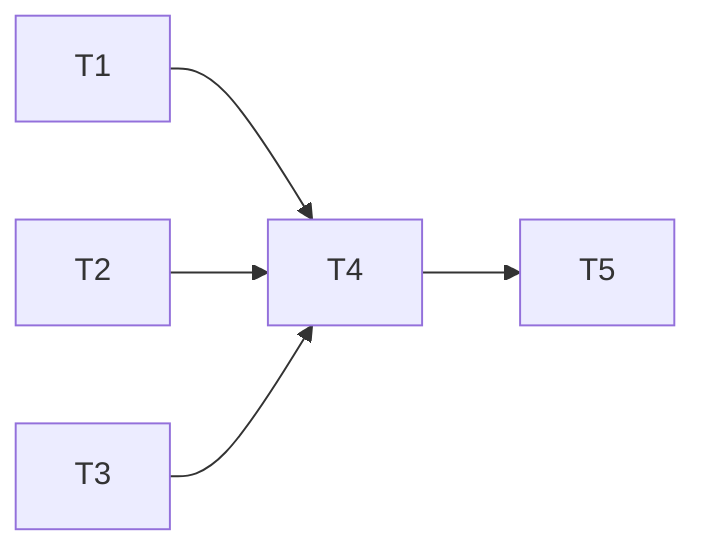

# 429 Key Exclusion — Implementation Tasks

### Dependency Graph



Tasks 1, 2, and 3 can run in parallel. Task 4 depends on all three. Task 5 is verification.

---

## Task 1: Server — Add `markKeyUnhealthy()` to `heartbeat.ts`

### What to build

Add a new exported function `markKeyUnhealthy(keyId, error?)` to `server/src/services/heartbeat.ts`. This function is the core of the eviction mechanism — it flips a key's health to `false` in the in-memory `keyHealthMap`, which immediately excludes it from routing.

### Exact changes

**File**: `server/src/services/heartbeat.ts`

Insert after the `isHeartbeatEnabled()` function (~L62), before the `getAllKeyHealth()` function:

```typescript
/** Mark a key as unhealthy in the per-key health map. The key will be excluded
 *  from routing by `isKeyHealthy()` until a successful heartbeat ping restores it.
 *  No-op when heartbeat is disabled — the cooldown system handles recovery instead.
 *
 *  Called from `proxy.ts` when a request returns 429 (rate limit) or 402 (payment
 *  required). The key is evicted immediately — no retries wasted on a key that
 *  told us it's at capacity. */
export function markKeyUnhealthy(keyId: number, error?: string): void {
  if (!isHeartbeatEnabled()) return;
  const prev = keyHealthMap.get(keyId);
  keyHealthMap.set(keyId, {
    penalty: (prev?.penalty ?? 0) + 1,
    lastPingAt: Date.now(),
    healthy: false,
    lastError: error ?? 'evicted by traffic 429',
  });
}
```

### What NOT to change

- `isKeyHealthy()` — no change needed; returns `false` for keys with `healthy: false`
- `isHeartbeatEnabled()` — no change; used as the gate
- `getAllKeyHealth()` — no change; already exposes the full `KeyHealth` objects including `lastError`
- `pingKey()` — no change; recovery path already works
- Timer logic, activity gate, cycle management — unchanged

### Verification

```typescript
// Unit test:
heartbeat.markKeyUnhealthy(1);
expect(heartbeat.isKeyHealthy(1)).toBe(false);

// No-op when disabled:
heartbeat.resetHeartbeatConfig();
// (set heartbeat_enabled = false)
heartbeat.markKeyUnhealthy(2);
expect(heartbeat.isKeyHealthy(2)).toBe(true); // cold key fallback

// Error message stored:
heartbeat.markKeyUnhealthy(3, '429 rate limit exceeded');
expect(heartbeat.getKeyHealth(3)?.lastError).toBe('429 rate limit exceeded');
```

---

## Task 2: Server — Add `routing.key_evicted` event to `events.ts`

### What to build

Add the `routing.key_evicted` variant to the `LiveEvent` union type in `server/src/services/events.ts`.

### Exact changes

**File**: `server/src/services/events.ts`

Find the `LiveEvent` union type (~L12-24) and add:

```typescript
| { type: 'routing.key_evicted'; id: string; provider: string; keyId: number; model: string; reason: 'rate_limited' | 'payment_required'; at: number }
```

Insert it after the `routing.provider_fastfail` entry (~L20) for logical grouping. The union should now look like:

```typescript
export type LiveEvent =
  | { type: 'request.start'; id: string; model?: string; stream: boolean; at: number }
  | { type: 'request.done'; id: string; model: string; provider: string; keyId: number; latencyMs: number; tokens?: { in: number; out: number }; at: number }
  | { type: 'request.error'; id: string; error: string; at: number }
  | { type: 'request.aborted'; id: string; at: number }
  | { type: 'routing.key_exhausted'; id: string; provider: string; keyId: number; model: string; reason: string; at: number }
  | { type: 'routing.key_retry'; id: string; provider: string; keyId: number; model: string; attempt: number; max: number; at: number }
  | { type: 'routing.model_switch'; id: string; from: string; to: string; reason: string; at: number }
  | { type: 'routing.provider_fastfail'; id: string; provider: string; failedModelCount: number; at: number }
  | { type: 'routing.key_evicted'; id: string; provider: string; keyId: number; model: string; reason: 'rate_limited' | 'payment_required'; at: number }  // NEW
  | { type: 'heartbeat.ping'; provider: string; model: string; keyId: number; success: boolean; latencyMs: number; error?: string; at: number }
  | { type: 'heartbeat.cycle_skipped'; reason: string; lastActivityAgeMs: number; at: number }
  | { type: 'degradation.boost'; modelDbId: number; oldBoost: number; newBoost: number; at: number }
  | { type: 'stream.chunk'; id: string; text: string; at: number };
```

### Verification

The TypeScript compiler will verify type safety. The existing `publish()` and `subscribeSse()` functions handle all `LiveEvent` variants uniformly — no changes needed to the event bus infrastructure.

---

## Task 3: Client — Add dashboard rendering to `live-events.tsx`

### What to build

Add the `KeyEvictedEvent` interface and rendering case for `routing.key_evicted` in `client/src/components/live-events.tsx`.

### Exact changes

**3a.** Add interface (after `ProviderFastFailEvent` ~L28):

```typescript
interface KeyEvictedEvent extends RequestEventBase {
  type: 'routing.key_evicted';
  provider: string;
  keyId: number;
  model: string;
  reason: 'rate_limited' | 'payment_required';
}
```

**3b.** Add to `LiveEvent` union (~L30-34):

```typescript
  | RequestStartEvent | RequestDoneEvent | RequestErrorEvent | RequestAbortedEvent
  | KeyExhaustedEvent | KeyRetryEvent | ModelSwitchEvent | ProviderFastFailEvent
  | KeyEvictedEvent                    // NEW
  | HeartbeatPingEvent | HeartbeatCycleSkippedEvent
  | StreamChunkEvent;
```

**3c.** Add case to `formatEvent` switch (after the `routing.provider_fastfail` case ~L91):

```typescript
    case 'routing.key_evicted':
      return { id: evt.id, ts, kind: 'warn',
        text: `🚫 Key #${evt.keyId} evicted (${evt.reason === 'rate_limited' ? '429 rate limit' : '402 out of credits'}) on ${evt.provider}/${evt.model}` };
```

### Critical invariants

- `kind: 'warn'` is already in the `LogEntry.kind` union (heartbeat spec added it)
- `'warn'` styling is already in the className conditional
- The keyId is rendered as `#${evt.keyId}` to visually match the `key_exhausted` event format

---

## Task 4: Server — Integrate eviction into `proxy.ts` retry loop

### What to build

Add the eviction check inside the proxy's retry catch block. When a retryable error is caught and classified as `'minor'` (429/402) and heartbeat is enabled, mark the key unhealthy and break the retry loop.

### Exact changes

**File**: `server/src/routes/proxy.ts`

**4a.** Add import at the top of the file (~L7-8):

`markKeyUnhealthy` is exported from `heartbeat.js`. Verify `isHeartbeatEnabled` is also imported.

```typescript
import { markKeyUnhealthy, isHeartbeatEnabled } from '../services/heartbeat.js';
```

(*Note: if `isHeartbeatEnabled` is already imported — verify first. It was added in the heartbeat spec. If not, add it.*)

**4b.** Add the eviction check inside the retry catch block (~L1210-1228). Find the existing code:

```typescript
if (isRetryableError(err)) {
  if (keyAttempt < PER_KEY_RETRIES - 1) {
    // Transient limit: retry same key immediately.
    lastError = err;
    publish({ type: 'routing.key_retry', ... });
    continue keyRetry;
  }
  // Last retry attempt exhausted → fall through to key exhaustion.
  lastError = err;
  break keyRetry;
}
```

Replace with:

```typescript
if (isRetryableError(err)) {
  // ── 429/402 key eviction ──────────────────────────────────
  // When a key returns a rate-limit or payment-required error
  // and heartbeat is enabled, mark it unhealthy immediately so
  // the router excludes it from the healthy pool. Only a successful
  // heartbeat ping can restore it — saving wasted retry attempts.
  if (classifyError(err) === 'minor' && isHeartbeatEnabled()) {
    markKeyUnhealthy(route.keyId, err.message?.slice(0, 120) ?? '429 rate limit');
    publish({
      type: 'routing.key_evicted',
      id: requestId,
      provider: route.platform,
      keyId: route.keyId,
      model: route.modelId,
      reason: isPaymentRequiredError(err) ? 'payment_required' : 'rate_limited',
      at: Date.now(),
    });
    // Skip remaining retries on this key — it told us it's at capacity.
    break keyRetry;
  }

  if (keyAttempt < PER_KEY_RETRIES - 1) {
    // Transient limit: retry same key immediately.
    lastError = err;
    publish({ type: 'routing.key_retry', ... });
    continue keyRetry;
  }
  // Last retry attempt exhausted → fall through to key exhaustion.
  lastError = err;
  break keyRetry;
}
```

**4c.** The `break keyRetry` when evicted falls through to the existing key exhaustion block (~L1252-1272) which handles `markExhausted`, `setCooldown`, `skipKeys.add`, `recordFailure`, and fast-fail — no changes needed there.

### Total new code

~18 lines including imports, blank lines, and comments.

### Verification

```typescript
// Test: 429 causes eviction mid-retry
const keyId = 1;
mockProvider.mockRejectedValue({ message: '429 rate limit', status: 429 });
await handleRequest(...);
expect(isKeyHealthy(keyId)).toBe(false);
expect(publish).toHaveBeenCalledWith(
  expect.objectContaining({ type: 'routing.key_evicted', keyId, reason: 'rate_limited' })
);

// Test: remaining retries skipped
expect(mockProvider).toHaveBeenCalledTimes(1); // Not PER_KEY_RETRIES times

// Test: 5xx does NOT evict
mockProvider.mockRejectedValue({ message: '503 service unavailable', status: 503 });
await handleRequest(...);
expect(isKeyHealthy(keyId)).toBe(true); // Not evicted

// Test: heartbeat disabled = no eviction
setHeartbeatEnabled(false);
mockProvider.mockRejectedValue({ message: '429 rate limit', status: 429 });
await handleRequest(...);
expect(isKeyHealthy(keyId)).toBe(true); // Cold-key fallback: assumed healthy
```

---

## Task 5: Run existing test suite to verify no regressions

### What to do

After Tasks 1-4 are complete, run the full test suite:

```bash
npm run test -w server
npm run test -w client
```

### Verify

- All existing tests pass (especially `routing-exhaustion.test.ts`, `router-bandit.test.ts`, `heartbeat.test.ts`)
- New eviction tests pass
- Client typecheck passes (`npm run test -w client`)
- No TypeScript compilation errors (verify the `LiveEvent` union is exhaustive)

### Expected failures

None. The 429 key exclusion is:
- Gated on `isHeartbeatEnabled()` which is `false` by default
- Only active on the `'minor'` classifyError path (429/402)
- Extends existing systems without modifying them — `isKeyHealthy()` was already the gating function

---

## Implementation Summary

| Task | File | Change Type | Lines |
|---|---|---|---|
| 1 | `server/src/services/heartbeat.ts` | New export `markKeyUnhealthy()` | +12 |
| 2 | `server/src/services/events.ts` | New `LiveEvent` variant | +1 |
| 3 | `client/src/components/live-events.tsx` | New interface + union + render case | +15 |
| 4 | `server/src/routes/proxy.ts` | New eviction check in retry loop | +18 |
| 5 | — | Run test suite | — |

**Total new code**: ~46 lines across 4 files. Zero new database columns. Zero new tables. Zero changes to routing, scoring, degradation, or cooldown logic.