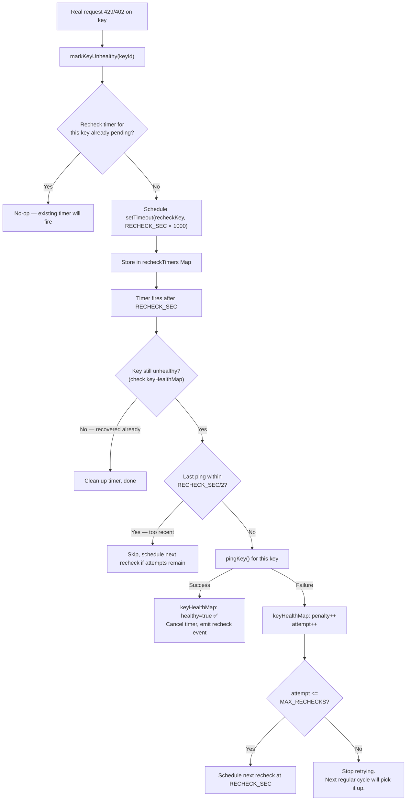

# Exhausted-Key Recheck — Design Document

## 1. Architecture Overview

The recheck extends the existing heartbeat system with per-key recovery timers. It does not introduce a new service — it adds to `heartbeat.ts` and reuses `pingKey()`.



**Key insight**: The recheck leverages the *existing* `pingKey()` function. No new provider call, no new key-decryption path — the recheck is a scheduling layer on top of the existing ping infrastructure.

---

## 2. Data Model

### 2.1 New Module-Level State (in `heartbeat.ts`)

```typescript
interface RecheckState {
  keyId: number;
  attempt: number;       // 1-based: 1 = first recheck, 2 = second, etc.
  timerRef: NodeJS.Timeout;
}

/** keyId → recheck state. One entry per exhausted key with a pending timer. */
const recheckTimers = new Map<number, RecheckState>();
```

### 2.2 Configuration (added to `readConfig()`)

```typescript
let _recheckSec: number | null = null;
let _maxRechecks: number | null = null;

// In readConfig():
_recheckSec = getFeatureSetting('heartbeat_exhausted_recheck_sec') as number;
_maxRechecks = getFeatureSetting('heartbeat_exhausted_max_rechecks') as number;
```

### 2.3 Feature Settings Registry (in `feature-settings.ts`)

Two new entries in the `REGISTRY` array, under the `Resilience` group:

```typescript
{
  key: 'heartbeat_exhausted_recheck_sec',
  label: 'Exhausted-Key Recheck (sec)',
  description:
    'Seconds after a key is marked unhealthy before the heartbeat automatically re-pings it. Lower values recover faster but may waste API budget on keys with long cooldowns.',
  type: 'number',
  default: 90,
  min: 15,
  max: 600,
  envVar: 'HEARTBEAT_EXHAUSTED_RECHECK_SEC',
  effect: 'restart',
  group: 'Resilience',
  parentToggle: 'heartbeat_enabled',
},
{
  key: 'heartbeat_exhausted_max_rechecks',
  label: 'Max Recheck Attempts',
  description:
    'Maximum re-ping attempts before giving up on an exhausted key. After this, the next regular heartbeat cycle handles recovery. Limits token spend on stubbornly-unhealthy keys.',
  type: 'number',
  default: 3,
  min: 1,
  max: 10,
  envVar: 'HEARTBEAT_EXHAUSTED_MAX_RECHECKS',
  effect: 'restart',
  group: 'Resilience',
  parentToggle: 'heartbeat_enabled',
},
```

---

## 3. Core Algorithm

### 3.1 Scheduling a Recheck (in `markKeyUnhealthy()`)

The existing `markKeyUnhealthy()` is extended to schedule a recheck after updating the health map:

```typescript
export function markKeyUnhealthy(keyId: number, error?: string): void {
  if (!isHeartbeatEnabled()) return;

  const prev = keyHealthMap.get(keyId);
  keyHealthMap.set(keyId, {
    penalty: (prev?.penalty ?? 0) + 1,
    lastPingAt: Date.now(),
    healthy: false,
    lastError: error ?? 'evicted by traffic 429',
  });

  // ── NEW: Schedule a proactive recheck ──
  scheduleRecheck(keyId);
}
```

### 3.2 `scheduleRecheck(keyId)`

```typescript
function scheduleRecheck(keyId: number): void {
  // FR-3: No duplicate timers for the same key
  if (recheckTimers.has(keyId)) return;

  const { recheckSec, maxRechecks } = readConfig();
  const attempt = 1; // first recheck

  const timerRef = setTimeout(() => {
    fireRecheck(keyId, attempt).catch(err => {
      console.error(`[Heartbeat] Recheck error for key#${keyId}:`, err);
    });
  }, recheckSec * 1000);

  recheckTimers.set(keyId, { keyId, attempt, timerRef });
}
```

### 3.3 `fireRecheck(keyId, attempt)`

```typescript
async function fireRecheck(keyId: number, attempt: number): Promise<void> {
  // Clean up the timer entry
  recheckTimers.delete(keyId);

  const health = keyHealthMap.get(keyId);
  if (!health || health.healthy) {
    // Key already recovered (by regular heartbeat or pokeKey) — done
    return;
  }

  const { recheckSec, maxRechecks, pingTimeoutMs } = readConfig();

  // FR-4: Skip if recently pinged
  const minRecencyMs = (recheckSec * 1000) / 2;
  if (Date.now() - health.lastPingAt < minRecencyMs) {
    // Too recent — schedule next if budget remains
    if (attempt < maxRechecks) {
      scheduleNextRecheck(keyId, attempt + 1);
    }
    return;
  }

  // FR-5: Check key is still enabled
  const db = getDb();
  const keyRow = db.prepare(
    "SELECT * FROM api_keys WHERE id = ? AND enabled = 1"
  ).get(keyId) as any | undefined;
  if (!keyRow) {
    return; // Key was disabled or deleted — stop
  }

  // FR-2: Pick highest-priority model for this key's platform
  const model = db.prepare(`
    SELECT m.id AS model_db_id, m.model_id
    FROM fallback_config fc
    JOIN models m ON m.id = fc.model_db_id AND m.enabled = 1
    WHERE fc.enabled = 1 AND m.platform = ?
    ORDER BY fc.priority ASC
    LIMIT 1
  `).get(keyRow.platform) as { model_db_id: number; model_id: string } | undefined;
  if (!model) return;

  const start = Date.now();

  // Re-use pingKey — this updates keyHealthMap on success/failure
  try {
    await pingKey(keyRow.platform, model.model_db_id, model.model_id, keyRow, pingTimeoutMs);

    // pingKey updated keyHealthMap. Check result.
    const newHealth = keyHealthMap.get(keyId);
    if (newHealth?.healthy) {
      // FR-10: Key recovered — cancel any pending timer (shouldn't be one, but defense)
      const pending = recheckTimers.get(keyId);
      if (pending) {
        clearTimeout(pending.timerRef);
        recheckTimers.delete(keyId);
      }

      // FR-6: Emit recheck success event
      publish({
        type: 'heartbeat.recheck',
        keyId,
        provider: keyRow.platform,
        model: model.model_id,
        success: true,
        latencyMs: Date.now() - start,
        attempt,
        at: Date.now(),
      });
    } else {
      // Still unhealthy — emit failure event and schedule next recheck
      publish({
        type: 'heartbeat.recheck',
        keyId,
        provider: keyRow.platform,
        model: model.model_id,
        success: false,
        latencyMs: Date.now() - start,
        attempt,
        error: newHealth?.lastError ?? 'still unhealthy',
        at: Date.now(),
      });

      // Schedule next recheck if budget remains
      if (attempt < maxRechecks) {
        scheduleNextRecheck(keyId, attempt + 1);
      }
    }
  } catch (err: any) {
    // pingKey threw — shouldn't normally happen (errors caught internally)
    publish({
      type: 'heartbeat.recheck',
      keyId,
      provider: keyRow.platform,
      model: model.model_id,
      success: false,
      latencyMs: Date.now() - start,
      attempt,
      error: (err?.message ?? 'unknown').slice(0, 120),
      at: Date.now(),
    });

    if (attempt < maxRechecks) {
      scheduleNextRecheck(keyId, attempt + 1);
    }
  }
}
```

### 3.4 `scheduleNextRecheck(keyId, nextAttempt)`

```typescript
function scheduleNextRecheck(keyId: number, nextAttempt: number): void {
  const { recheckSec } = readConfig();

  const timerRef = setTimeout(() => {
    fireRecheck(keyId, nextAttempt).catch(err => {
      console.error(`[Heartbeat] Recheck error for key#${keyId} (attempt ${nextAttempt}):`, err);
    });
  }, recheckSec * 1000);

  recheckTimers.set(keyId, { keyId, attempt: nextAttempt, timerRef });
}
```

### 3.5 Shutdown / Cleanup

`stopHeartbeat()` must clear all pending recheck timers:

```typescript
export function stopHeartbeat(): void {
  if (timerRef) {
    clearInterval(timerRef);
    timerRef = null;
    console.log('[Heartbeat] Timer stopped');
  }

  // ── NEW: Clear all pending recheck timers ──
  for (const [keyId, state] of recheckTimers) {
    clearTimeout(state.timerRef);
  }
  recheckTimers.clear();
}
```

`resetHeartbeatConfig()` must also clear recheck state:

```typescript
export function resetHeartbeatConfig(): void {
  _enabled = null;
  _intervalMs = null;
  _activityWindowMs = null;
  _pingTimeoutMs = null;
  _staggerMs = null;
  _concurrency = null;
  _recheckSec = null;      // NEW
  _maxRechecks = null;      // NEW
  keyHealthMap.clear();

  // Clear pending rechecks
  for (const [, state] of recheckTimers) {
    clearTimeout(state.timerRef);
  }
  recheckTimers.clear();
}
```

---

## 4. Integration Points

### 4.1 Changes to `server/src/services/heartbeat.ts`

**Modified functions:**
- `markKeyUnhealthy()` — add call to `scheduleRecheck(keyId)`
- `stopHeartbeat()` — add loop to clear all recheck timers
- `resetHeartbeatConfig()` — add config vars and timer cleanup

**New internal functions:**
- `scheduleRecheck(keyId)` — creates the first recheck timer
- `fireRecheck(keyId, attempt)` — called by timer, executes pingKey, schedules next if needed
- `scheduleNextRecheck(keyId, nextAttempt)` — schedules subsequent rechecks

**New module state:**
- `recheckTimers: Map<number, RecheckState>` — pending recheck timer references
- `_recheckSec: number | null` / `_maxRechecks: number | null` — cached config

**New export (optional, for testing):**
- `getPendingRechecks(): Map<number, RecheckState>` — read-only view of pending timers

### 4.2 Changes to `server/src/services/events.ts`

Add to `LiveEvent` union:

```typescript
| { type: 'heartbeat.recheck'; keyId: number; provider: string; model: string; success: boolean; latencyMs: number; attempt: number; error?: string; at: number }
```

### 4.3 Changes to `server/src/services/feature-settings.ts`

Add two entries to `REGISTRY` (see §2.3 above).

### 4.4 Changes to `client/src/components/live-events.tsx`

Add interface and rendering case:

```typescript
interface HeartbeatRecheckEvent extends LiveEventBase {
  type: 'heartbeat.recheck';
  keyId: number;
  provider: string;
  model: string;
  success: boolean;
  latencyMs: number;
  attempt: number;
  error?: string;
}
```

In `formatEvent` switch:

```typescript
case 'heartbeat.recheck':
  if (evt.success) {
    return { id: evt.id, ts, kind: 'info',
      text: `⚡ [recheck] key#${evt.keyId} on ${evt.provider}/${evt.model} recovered (${evt.latencyMs}ms, attempt ${evt.attempt})` };
  }
  return { id: evt.id, ts, kind: 'warn',
    text: `⚡ [recheck] key#${evt.keyId} on ${evt.provider}/${evt.model} still unhealthy: ${evt.error?.slice(0, 60) ?? 'unknown'} (attempt ${evt.attempt})` };
```

### 4.5 Files NOT Changed

- `router.ts` — no changes; `isKeyHealthy()` reads from `keyHealthMap` which the recheck updates
- `key-exhaustion.ts` — no changes; recheck operates on `keyHealthMap`, not `exhaustionMap`
- `degradation.ts` — no changes; `pingKey()` already calls `recordSuccess`/`recordFailure`
- `proxy.ts` — no changes; `markKeyUnhealthy()` call is unchanged
- `ratelimit.ts` — no changes; recheck pings don't interact with cooldowns

---

## 5. Worked Example

**Setup**: Provider "openai" with 3 keys. Heartbeat enabled, recheck interval 90s, max rechecks 3.

| Time | Event | Key Health State |
|---|---|---|
| T=0 | Key #1 hits 429 on real request. `markKeyUnhealthy(1)` called. | #1: unhealthy, penalty=1. Recheck timer set for T+90s. |
| T=30 | Key #2 hits 429. `markKeyUnhealthy(2)` called. | #1: unhealthy. #2: unhealthy, penalty=1. Recheck timer set for T+120s. |
| T=90 | Recheck fires for key #1. Ping succeeds. | #1: **healthy**, penalty=0 ✅. Re-check timer cleared. #2: still pending. |
| T=120 | Recheck fires for key #2. Ping fails (still rate-limited). | #2: unhealthy, penalty=2. Attempt 2 scheduled for T+210s. |
| T=210 | Recheck fires for key #2 (attempt 2). Ping succeeds. | #2: **healthy**, penalty=0 ✅. |
| — | All keys healthy. Router has full pool available. | ✅ |

**Without recheck**: Both keys stay unhealthy until the next regular heartbeat cycle (up to 10 minutes). During that window, the router only has key #3 — reducing throughput by ⅔.

---

## 6. Edge Cases

### 6.1 Key Recovers Between Recheck and Timer Fire

Key #1 is unhealthy at T=0. Recheck scheduled for T+90s. At T=60s, the regular heartbeat cycle pings key #1 and it succeeds — `keyHealthMap` now shows healthy. At T=90s, the recheck timer fires. `fireRecheck` checks `health.healthy` → true. Returns immediately (FR-3/cancellation path). **Correct**: no wasted ping.

### 6.2 Key Disabled While Recheck Pending

Key #1 is unhealthy, recheck at T+90s. At T=45s, operator disables the key. Recheck fires at T=90s, queries `api_keys WHERE id = 1 AND enabled = 1` → no row. Returns silently. **Correct**: no ping sent to disabled key.

### 6.3 Multiple 429s on Same Key (Windmill Pattern)

Key #1 gets 429'd at T=0, T=5s, T=10s (three consecutive requests). `markKeyUnhealthy(1)` is called three times. First call schedules a recheck. Second and third calls find `recheckTimers.has(1) === true` → no-op. Single recheck at T+90s covers it. **Correct**: no timer storm.

### 6.4 Key Exhausted for Multiple Models (Same Key ID)

`markKeyUnhealthy(keyId)` is per-key (not per-key-per-model). A key that's unhealthy is unhealthy globally. A single recheck per key is correct — a successful ping on any model clears the key's global health state. **Correct**: no per-model recheck explosion.

### 6.5 Max Rechecks Exhausted

Key remains unhealthy after 3 recheck attempts. The recheck system stops. The key stays benched until the next regular heartbeat cycle (within 10 minutes by default). This is the designed fallback — the regular cycle handles long-lived outages. **Correct**: bounded retry budget prevents unbounded token spend.

### 6.6 Recheck Timer Fires During Regular Heartbeat Cycle

Regular heartbeat cycle is in progress (cycleInProgress=true). Recheck timer fires for a key. Since `pingKey` doesn't gate on `cycleInProgress`, the recheck runs concurrently. The regular cycle may also ping this key. `keyHealthMap` updates from both are idempotent (latest wins). The recheck's recency check (FR-4) helps if the regular cycle pinged the key very recently, but a concurrent ping is also harmless — it's just one extra ~10-token request. **Acceptable**: the double-ping is rare (only when the recheck timer fires during the ~30s window of a regular cycle) and cheap.

### 6.7 Server Restarts Mid-Recheck

Pending `setTimeout` references are lost on process exit. After restart, the startup prewarm cycle pings all keys. Exhausted keys that were mid-recheck will be discovered by the prewarm. No persistent state needed. **Correct**: in-memory timers are fire-and-forget.

---

## 7. Testing Strategy

### 7.1 Unit Tests (in `heartbeat.test.ts`)

| Test Case | Setup | Assertion |
|---|---|---|
| `markKeyUnhealthy` schedules recheck | Mark key unhealthy with heartbeat enabled | `recheckTimers.has(keyId)` is true |
| No duplicate recheck for same key | Mark same key unhealthy twice | Only one timer in `recheckTimers` |
| Recheck recovery clears timer | Schedule recheck, mock `pingKey` to succeed | Timer cleared, key healthy, `recheck` event emitted with `success: true` |
| Recheck failure schedules next | Schedule recheck, mock `pingKey` to fail, `maxRechecks=3` | Second timer scheduled, `recheck` event with `success: false`, `attempt: 1` |
| Max rechecks stops retrying | 3 recheck failures, `maxRechecks=3` | No 4th timer scheduled |
| Recency check skips ping | Set `lastPingAt` to recent, fire recheck | No ping sent, next recheck scheduled |
| Key already healthy → recheck no-ops | Mark key healthy before timer fires | Timer fires, returns immediately, no event |
| Key disabled → recheck no-ops | Disable key before timer fires | Timer fires, returns immediately, no event |
| `stopHeartbeat` clears all rechecks | Multiple pending rechecks | All `setTimeout` cleared, map empty |
| `resetHeartbeatConfig` clears rechecks | Pending rechecks | All cleared |
| Disabled heartbeat → no recheck | `heartbeat_enabled=false`, `markKeyUnhealthy()` called | No timer scheduled |
| Recheck config read from feature-settings | Custom `heartbeat_exhausted_recheck_sec` | Timer uses correct delay |

### 7.2 Integration Considerations

- Tests use `vi.useFakeTimers()` to control `setTimeout` — advance time to trigger rechecks
- Mock `pingKey` by spying on the module or by mocking `buildProviderFor` to return controlled responses
- Mock `getDb` with an in-memory SQLite database pre-seeded with key and model rows
- Event assertions: spy on `publish` and verify `heartbeat.recheck` event shape
- `afterEach` must call `stopHeartbeat()` and `vi.useRealTimers()` for cleanup
