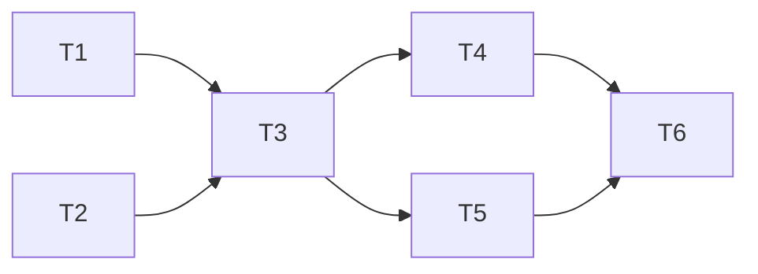

# Exhausted-Key Recheck — Implementation Tasks

### Dependency Graph



Tasks 1 and 2 can run in parallel. Task 3 depends on both. Tasks 4 and 5 can run in parallel after Task 3. Task 6 depends on all.

---

## Task 1: Server — Add event type to `events.ts`

### What to build

Add the `heartbeat.recheck` variant to the `LiveEvent` union type.

### Exact changes

In `server/src/services/events.ts`, find the `LiveEvent` union type and add:

```typescript
| { type: 'heartbeat.recheck'; keyId: number; provider: string; model: string; success: boolean; latencyMs: number; attempt: number; error?: string; at: number }
```

### What NOT to change

- `publish()` function — no changes needed
- `subscribeSse()` — no changes needed
- Existing `heartbeat.ping` and `heartbeat.cycle_skipped` variants — no changes

---

## Task 2: Server — Add feature settings to `feature-settings.ts`

### What to build

Add two new entries to the `REGISTRY` array for the recheck configuration.

### Exact changes

In `server/src/services/feature-settings.ts`, after the existing `heartbeat_concurrency` entry (~L145), add:

```typescript
{
  key: 'heartbeat_exhausted_recheck_sec',
  label: 'Exhausted-Key Recheck (sec)',
  description:
    'Seconds after a key is marked unhealthy before the heartbeat automatically re-pings it. Lower values recover faster but may waste API budget on keys with long cooldowns.',
  type: 'number',
  default: 90,
  min: 15,
  max: 600,
  envVar: 'HEARTBEAT_EXHAUSTED_RECHECK_SEC',
  effect: 'restart',
  group: 'Resilience',
  parentToggle: 'heartbeat_enabled',
},
{
  key: 'heartbeat_exhausted_max_rechecks',
  label: 'Max Recheck Attempts',
  description:
    'Maximum re-ping attempts before giving up on an exhausted key. After this, the next regular heartbeat cycle handles recovery. Limits token spend on stubbornly-unhealthy keys.',
  type: 'number',
  default: 3,
  min: 1,
  max: 10,
  envVar: 'HEARTBEAT_EXHAUSTED_MAX_RECHECKS',
  effect: 'restart',
  group: 'Resilience',
  parentToggle: 'heartbeat_enabled',
},
```

### Critical invariants

- Both settings use `parentToggle: 'heartbeat_enabled'` — they appear dimmed/disabled in the settings UI when heartbeat is off
- `effect: 'restart'` — changing these requires a server restart to take effect (timers are created from config at scheduling time)
- Default 90s matches `transient_cooldown_sec` default — operators have a natural analog

---

## Task 3: Server — Extend `heartbeat.ts` with recheck logic

### What to build

Add the recheck scheduling and firing logic to the existing heartbeat module.

### New module state

Add after the existing `cycleInProgress` variable (~L123):

```typescript
interface RecheckState {
  keyId: number;
  attempt: number;       // 1-based
  timerRef: ReturnType<typeof setTimeout>;
}

const recheckTimers = new Map<number, RecheckState>();
```

### New config fields

Add to the module-level config cache (~L88-93):

```typescript
let _recheckSec: number | null = null;
let _maxRechecks: number | null = null;
```

In `readConfig()` (~L95-105), add:

```typescript
_recheckSec = getFeatureSetting('heartbeat_exhausted_recheck_sec') as number;
_maxRechecks = getFeatureSetting('heartbeat_exhausted_max_rechecks') as number;
```

And add `recheckSec` and `maxRechecks` to the return object:

```typescript
return { enabled: _enabled, intervalMs: _intervalMs!, activityWindowMs: _activityWindowMs!, pingTimeoutMs: _pingTimeoutMs!, staggerMs: _staggerMs!, concurrency: _concurrency!, recheckSec: _recheckSec!, maxRechecks: _maxRechecks! };
```

### New internal functions

**`scheduleRecheck(keyId: number): void`**

```typescript
function scheduleRecheck(keyId: number): void {
  // FR-3: No duplicate timers
  if (recheckTimers.has(keyId)) return;

  const { recheckSec, maxRechecks } = readConfig();
  const attempt = 1;

  const timerRef = setTimeout(() => {
    fireRecheck(keyId, attempt).catch(err => {
      console.error(`[Heartbeat] Recheck error for key#${keyId}:`, err);
    });
  }, recheckSec * 1000);
  // Don't prevent shutdown — timer.unref() if desired, but short-lived
  // timers (90s default) are unlikely to block. Omit for simplicity.

  recheckTimers.set(keyId, { keyId, attempt, timerRef });
}
```

**`fireRecheck(keyId: number, attempt: number): Promise<void>`**

See design.md §3.3 for the full implementation. Key steps:
1. Delete timer entry from map
2. Check key is still unhealthy in `keyHealthMap` — if healthy, return
3. Check recency (last ping within `recheckSec/2` → skip, schedule next if budget left)
4. Check key is still enabled in DB — if disabled/deleted, return
5. Pick highest-priority model for the key's platform
6. Call `pingKey()` (existing function)
7. Check result in `keyHealthMap`, emit `heartbeat.recheck` event
8. If still unhealthy and `attempt < maxRechecks`, schedule next recheck

**`scheduleNextRecheck(keyId: number, nextAttempt: number): void`**

```typescript
function scheduleNextRecheck(keyId: number, nextAttempt: number): void {
  const { recheckSec } = readConfig();

  const timerRef = setTimeout(() => {
    fireRecheck(keyId, nextAttempt).catch(err => {
      console.error(`[Heartbeat] Recheck error for key#${keyId} (attempt ${nextAttempt}):`, err);
    });
  }, recheckSec * 1000);

  recheckTimers.set(keyId, { keyId, attempt: nextAttempt, timerRef });
}
```

### Modified functions

**`markKeyUnhealthy(keyId, error?)`** (~L61-70)

Add after the `keyHealthMap.set(...)` call:

```typescript
// ── NEW: Schedule a proactive recheck ──
scheduleRecheck(keyId);
```

**`stopHeartbeat()`** (~L159-165)

Add after the `clearInterval(timerRef)` block:

```typescript
// ── NEW: Clear all pending recheck timers ──
for (const [, state] of recheckTimers) {
  clearTimeout(state.timerRef);
}
recheckTimers.clear();
```

**`resetHeartbeatConfig()`** (~L109-117)

Add to the null resets:

```typescript
_recheckSec = null;
_maxRechecks = null;
```

Add after `keyHealthMap.clear()`:

```typescript
// Clear pending rechecks
for (const [, state] of recheckTimers) {
  clearTimeout(state.timerRef);
}
recheckTimers.clear();
```

### Optional export (for testing)

```typescript
/** Get pending recheck timers (read-only, for testing). */
export function getPendingRechecks(): ReadonlyMap<number, { keyId: number; attempt: number }> {
  return new Map([...recheckTimers].map(([k, v]) => [k, { keyId: v.keyId, attempt: v.attempt }]));
}
```

### Critical invariants

- `recheckTimers.has(keyId)` guard prevents duplicate timers for the same key
- All `setTimeout` references are stored so they can be cleared on shutdown
- `fireRecheck` deletes the timer entry FIRST — if it schedules a next recheck, it creates a new entry
- The recency check uses `health.lastPingAt` which is updated by both `pingKey()` and `markKeyUnhealthy()`
- Key disabled/deleted check happens inside `fireRecheck` (at timer-fire time, not at schedule time) — a key may be disabled after the timer is set

---

## Task 4: Client — Add dashboard rendering to `live-events.tsx`

### What to build

Add the `HeartbeatRecheckEvent` interface and rendering case for `heartbeat.recheck`.

### Exact changes

**4a.** Add interface (after `HeartbeatPingEvent`):

```typescript
interface HeartbeatRecheckEvent extends LiveEventBase {
  type: 'heartbeat.recheck'; keyId: number; provider: string; model: string; success: boolean; latencyMs: number; attempt: number; error?: string;
}
```

**4b.** Add to `LiveEvent` union:

```typescript
type LiveEvent = ... | HeartbeatPingEvent | HeartbeatRecheckEvent;
```

**4c.** Add case to `formatEvent` switch:

```typescript
case 'heartbeat.recheck':
  if (evt.success) {
    return { id: evt.id, ts, kind: 'info',
      text: `⚡ [recheck] key#${evt.keyId} on ${evt.provider}/${evt.model} recovered (${evt.latencyMs}ms, attempt ${evt.attempt})` };
  }
  return { id: evt.id, ts, kind: 'warn',
    text: `⚡ [recheck] key#${evt.keyId} on ${evt.provider}/${evt.model} still unhealthy: ${evt.error?.slice(0, 60) ?? 'unknown'} (attempt ${evt.attempt})` };
```

### Critical invariants

- ⚡ prefix distinguishes recheck events from regular ♥ heartbeat events
- `attempt` number is shown so operators can track retry progression
- Failure events include truncated error text for debugging

---

## Task 5: Tests — Add unit tests for recheck logic

### What to build

Extend the existing `server/src/__tests__/services/heartbeat.test.ts` with recheck test groups.

### Test structure

Use the existing `beforeEach`/`afterEach` with `vi.useFakeTimers()`.

### Test cases (minimum set)

#### Group: Recheck scheduling

| Test | Setup | Assertion |
|---|---|---|
| `markKeyUnhealthy` schedules recheck | Heartbeat enabled, mark key unhealthy | `getPendingRechecks().has(keyId)` is true |
| No duplicate recheck for same key | Mark same key unhealthy twice | Only one entry in `getPendingRechecks()` |
| Disabled heartbeat → no recheck | `heartbeat_enabled=false`, mark unhealthy | `getPendingRechecks()` is empty |

#### Group: Recheck execution

| Test | Setup | Assertion |
|---|---|---|
| Recheck success clears timer | Advance time past `recheckSec`, mock `pingKey` success | Timer cleared, key healthy, `heartbeat.recheck` event with `success: true, attempt: 1` |
| Recheck failure schedules next | Mock `pingKey` failure, `maxRechecks=3` | `recheck` event with `success: false`, next recheck scheduled |
| Max rechecks stops retrying | 3 failures, `maxRechecks=3` | No 4th timer after 3rd failure |
| Recency check skips ping | Set `lastPingAt` to very recent | No ping sent, next recheck scheduled |
| Key already healthy → recheck no-ops | Mark key healthy before timer fires | Timer fires, returns immediately, no `recheck` event |
| Key disabled → recheck no-ops | Set `enabled=0` in DB | Timer fires, returns immediately, no `recheck` event |

#### Group: Cleanup

| Test | Setup | Assertion |
|---|---|---|
| `stopHeartbeat` clears all rechecks | Multiple pending recheck timers | All timers cleared, map empty |
| `resetHeartbeatConfig` clears rechecks | Pending recheck timers | All cleared |

#### Group: Event shape

| Test | Assertion |
|---|---|
| Success event | `heartbeat.recheck` with `keyId`, `provider`, `model`, `success: true`, `latencyMs`, `attempt`, `at` |
| Failure event | `heartbeat.recheck` with `success: false`, `error` field populated |

### Critical invariants

- Use `vi.useFakeTimers()` and `vi.advanceTimersByTime()` — no real waiting
- `afterEach` must call `stopHeartbeat()` and `vi.useRealTimers()`
- Mock `buildProviderFor` returns a mock provider with controllable `chatCompletion`
- Verify no `setCooldown` or `recordRequest` calls from recheck pings (same as regular heartbeat)

---

## Task 6: Run existing test suite to verify no regressions

### What to do

After Tasks 1-5 are complete, run:

```bash
npm run test -w server
```

Verify:
- All existing tests pass (especially `heartbeat.test.ts`, `routing-exhaustion.test.ts`, `router-bandit.test.ts`)
- New recheck test group passes
- Client typecheck passes (`npm run test -w client` or equivalent)

### Expected failures

None — the recheck is additive. When heartbeat is disabled (default), `markKeyUnhealthy()` returns early (existing guard) and no recheck timers are created. The `scheduleRecheck()` call is after the `isHeartbeatEnabled()` guard in `markKeyUnhealthy()`.
