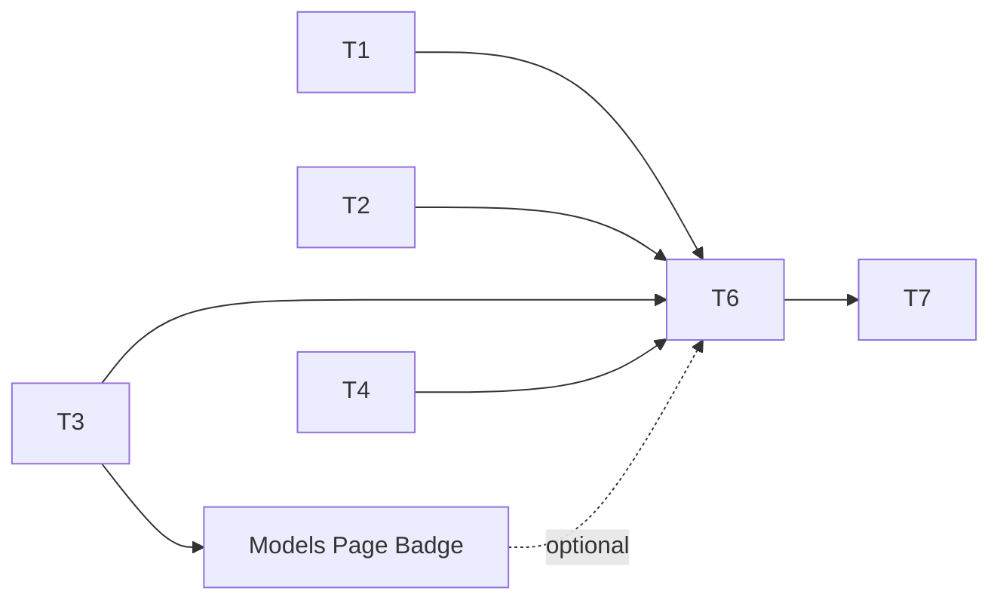

# Heartbeat Auto-Disable — Implementation Tasks

### Dependency Graph



Tasks 1–4 can run in parallel. Task 5 (dashboard badge) depends on T3. Task 6 (integration) depends on T1–T4. Task 7 is verification.

---

## Task 1: Server — Add `heartbeat_auto_disable_pct` to `feature-settings.ts`

### What to build

Add a new feature setting registry entry for the auto-disable threshold percentage. This makes the setting available in the Settings UI and through `getFeatureSetting()`.

### Exact changes

**File**: `server/src/services/feature-settings.ts`

Find the `REGISTRY` array and add a new entry in the `Resilience` group, after the heartbeat settings (~L55-80). Insert before the `Sessions` group comment:

```typescript
  {
    key: 'heartbeat_auto_disable_pct',
    label: 'Auto-Disable Unhealthy Key %',
    description:
      'When ≥ this percentage of a model\'s API keys are unhealthy (heartbeat pings failing or 429-evicted), the model is automatically disabled. Set to 0 to disable auto-disable entirely; set to 100 to disable only when all keys fail; set to 1 for aggressive single-key triggering.',
    type: 'number',
    default: 0,
    min: 0,
    max: 100,
    envVar: 'HEARTBEAT_AUTO_DISABLE_PCT',
    effect: 'live',
    group: 'Resilience',
    parentToggle: 'heartbeat_enabled',
  },
```

### Verification

```typescript
// Unit test:
expect(getFeatureSetting('heartbeat_auto_disable_pct')).toBe(0);

// With env var override:
process.env.HEARTBEAT_AUTO_DISABLE_PCT = '75';
expect(getFeatureSetting('heartbeat_auto_disable_pct')).toBe(75);

// Clamping:
process.env.HEARTBEAT_AUTO_DISABLE_PCT = '150';
// Should either clamp to 100 or fall back to default (depending on parseNumber behavior)
```

---

## Task 2: Server — Add `heartbeat.auto_disable` event to `events.ts`

### What to build

Add the `heartbeat.auto_disable` variant to the `LiveEvent` union in `server/src/services/events.ts`.

### Exact changes

**File**: `server/src/services/events.ts`

Find the `LiveEvent` union (~L12-24) and add after the `heartbeat.cycle_skipped` entry (~L22):

```typescript
| { type: 'heartbeat.auto_disable'; provider: string; model: string; modelDbId: number; totalKeys: number; unhealthyKeys: number; threshold: number; at: number }
```

### Verification

The TypeScript compiler will verify type safety. The event is only emitted when a model transitions from enabled → disabled.

---

## Task 3: Server — Add DB migration for `auto_disabled_at` column

### What to build

Add a migration to add the `auto_disabled_at` column to the `models` table. This column distinguishes auto-disable from manual disable in the dashboard.

### Exact changes

**File**: `server/src/db/migrations.ts`

Add a new migration function (pattern: `migrateHeartbeatAutoDisableColumn` or similar, called in the migration chain). The SQL:

```sql
ALTER TABLE models ADD COLUMN auto_disabled_at DATETIME DEFAULT NULL;
```

Update the model enable/disable endpoints in the models route to clear `auto_disabled_at` when a model is re-enabled:

```typescript
// When model is re-enabled (enabled = 1), clear auto_disabled_at
db.prepare("UPDATE models SET enabled = 1, auto_disabled_at = NULL WHERE id = ?")
  .run(modelDbId);
```

And optionally set it to NULL when manually disabled:

```typescript
// When model is manually disabled, clear auto_disabled_at (wasn't auto)
db.prepare("UPDATE models SET enabled = 0, auto_disabled_at = NULL WHERE id = ?")
  .run(modelDbId);
```

This ensures the auto-disable badge only shows when the heartbeat system was the source of disable.

### Critical invariants

- `auto_disabled_at` must be set in the same UPDATE that sets `enabled = 0` in `evaluateAutoDisable()`
- Re-enabling a model must ALWAYS clear `auto_disabled_at`, whether it was auto-disabled or not
- Manual disable must clear `auto_disabled_at` (to distinguish from auto-disable)

---

## Task 4: Client — Add dashboard rendering to `live-events.tsx`

### What to build

Add the `HeartbeatAutoDisableEvent` interface and rendering case for `heartbeat.auto_disable`.

### Exact changes

**4a.** Add interface (after `HeartbeatCycleSkippedEvent` ~L28):

```typescript
interface HeartbeatAutoDisableEvent extends TimestampOnly {
  type: 'heartbeat.auto_disable';
  provider: string;
  model: string;
  modelDbId: number;
  totalKeys: number;
  unhealthyKeys: number;
  threshold: number;
}
```

**4b.** Add to `LiveEvent` union (~L30-34):

```typescript
  | HeartbeatPingEvent | HeartbeatCycleSkippedEvent | HeartbeatAutoDisableEvent  // NEW
```

**4c.** Add case to `formatEvent` switch (after the `heartbeat.cycle_skipped` case ~L92):

```typescript
    case 'heartbeat.auto_disable':
      return { id: 'hb', ts, kind: 'warn',
        text: `🤖 Auto-disabled ${evt.provider}/${evt.model}: ${evt.unhealthyKeys}/${evt.totalKeys} keys unhealthy (threshold ${evt.threshold}%)` };
```

---

## Task 5: Client — Add auto-disable badge to Models page (optional)

### What to build

Modify the Models page to show a visual indicator when a model was auto-disabled (`auto_disabled_at IS NOT NULL`).

### Exact changes

**File**: `client/src/pages/ModelsPage.tsx` (or equivalent)

**5a.** Add `autoDisabledAt` to the model type from the API (if not already included):

```typescript
interface ModelRow {
  id: number;
  platform: string;
  model_id: string;
  display_name: string;
  enabled: boolean;
  auto_disabled_at: string | null;  // NEW
  // ... other fields
}
```

**5b.** In the model row rendering, when `enabled === false && auto_disabled_at !== null`, render a badge:

```tsx
{model.auto_disabled_at && (
  <span className="text-xs text-amber-600 dark:text-amber-400 ml-2" title={`Auto-disabled at ${model.auto_disabled_at}`}>
    🤖 auto
  </span>
)}
```

**5c.** Update the `GET /api/models` endpoint (`server/src/routes/models.ts`) to include `auto_disabled_at` in the response. The SELECT already uses `SELECT m.*`, so if the column exists, it's included automatically. Verify.

If the endpoint has an explicit column list, add `m.auto_disabled_at` to the SELECT.

---

## Task 6: Server — Add `evaluateAutoDisable()` to `heartbeat.ts` and wire into `runCycle()`

### What to build

Add the core auto-disable evaluation function and integrate it into the heartbeat cycle.

### Exact changes

**File**: `server/src/services/heartbeat.ts`

**6a.** Add a config reader helper near the other config functions (~L60-80):

```typescript
function getAutoDisableThresholdPct(): number {
  return getFeatureSetting('heartbeat_auto_disable_pct') as number;
}
```

**6b.** Add the `evaluateAutoDisable()` function. Insert near the bottom of the file, before the helper functions:

```typescript
interface AutoDisableResult {
  modelDbId: number;
  platform: string;
  modelId: string;
  totalKeys: number;
  unhealthyKeys: number;
  disabled: boolean;
}

function evaluateAutoDisable(
  db: ReturnType<typeof getDb>,
  modelDbId: number,
  platform: string,
  modelId: string,
): AutoDisableResult | null {
  const threshold = getAutoDisableThresholdPct();
  const allKeys = db.prepare(
    "SELECT id FROM api_keys WHERE platform = ? AND enabled = 1"
  ).all(platform) as Array<{ id: number }>;

  const total = allKeys.length;
  if (total === 0) return null;

  let unhealthy = 0;
  for (const k of allKeys) {
    const health = keyHealthMap.get(k.id);
    if (health && !health.healthy) unhealthy++;
    else if (!health) unhealthy++; // Cold key = assumed unhealthy
  }

  const pct = (unhealthy / total) * 100;
  if (pct < threshold) return null;

  const info = db.prepare(
    "SELECT enabled FROM models WHERE id = ?"
  ).get(modelDbId) as { enabled: number } | undefined;

  if (!info || info.enabled === 0) {
    return { modelDbId, platform, modelId, totalKeys: total, unhealthyKeys: unhealthy, disabled: false };
  }

  // Disable the model and mark it as auto-disabled
  db.prepare(
    "UPDATE models SET enabled = 0, auto_disabled_at = datetime('now') WHERE id = ?"
  ).run(modelDbId);

  return { modelDbId, platform, modelId, totalKeys: total, unhealthyKeys: unhealthy, disabled: true };
}
```

**6c.** Modify `runCycle()` to collect pinged models and evaluate after pings:

```typescript
async function runCycle(skipGate = false): Promise<void> {
  if (cycleInProgress) return;
  cycleInProgress = true;

  try {
    const now = Date.now();
    const { activityWindowMs, staggerMs, pingTimeoutMs } = readConfig();

    // ── Activity gate ──
    if (!skipGate && (lastActivityAt === 0 || now - lastActivityAt > activityWindowMs)) {
      publish({ type: 'heartbeat.cycle_skipped', reason: 'activity_gate', ... });
      return;
    }

    // ── Get enabled models ──
    const db = getDb();
    const models = db.prepare(`
      SELECT m.platform, m.id AS model_db_id, m.model_id, MIN(fc.priority) AS priority
      FROM fallback_config fc
      JOIN models m ON m.id = fc.model_db_id AND m.enabled = 1
      WHERE fc.enabled = 1
      GROUP BY m.platform, m.id, m.model_id
      ORDER BY priority ASC
    `).all() as Array<{ platform: string; model_db_id: number; model_id: string }>;

    if (models.length === 0) return;

    // ── Collect ping tasks + track which models were pinged ──
    const pingTasks: Array<{ ... }> = [];
    const pingedModels = new Set<string>(); // "platform:modelDbId" dedup key

    const seenKeys = new Set<number>();
    for (const model of models) {
      const keys = db.prepare(
        "SELECT * FROM api_keys WHERE platform = ? AND enabled = 1 AND status IN ('healthy', 'unknown', 'error')"
      ).all(model.platform) as any[];

      // Register this model for auto-disable evaluation even if its keys
      // were already seen for a prior model on the same platform.
      if (keys.length > 0) {
        pingedModels.add(`${model.platform}:${model.model_db_id}:${model.model_id}`);
      }

      for (const key of keys) {
        if (seenKeys.has(key.id)) continue;
        seenKeys.add(key.id);
        pingTasks.push({ platform: model.platform, modelDbId: model.model_db_id, modelId: model.model_id, key });
      }
    }

    // ── Ping each key (staggered) ──
    for (let i = 0; i < pingTasks.length; i++) {
      const task = pingTasks[i];
      try {
        await pingKey(task.platform, task.modelDbId, task.modelId, task.key, pingTimeoutMs);
      } catch (e) {
        console.error(`[Heartbeat] Ping error for key#${task.key.id}:`, e);
      }
      if (staggerMs > 0 && i < pingTasks.length - 1) {
        await sleep(staggerMs);
      }
    }

    // ── Auto-disable evaluation ──
    // After all pings complete, evaluate each pinged model's key health.
    // If ≥ threshold % of keys are unhealthy, disable the model.
    for (const key of pingedModels) {
      const parts = key.split(':');
      const platform = parts[0];
      const modelDbIdStr = parts[1];
      const modelId = parts.slice(2).join(':'); // model IDs may contain colons (e.g. qwen3-coder:480b)
      const modelDbId = parseInt(modelDbIdStr, 10);
      const result = evaluateAutoDisable(db, modelDbId, platform, modelId);
      if (result?.disabled) {
        publish({
          type: 'heartbeat.auto_disable',
          provider: result.platform,
          model: result.modelId,
          modelDbId: result.modelDbId,
          totalKeys: result.totalKeys,
          unhealthyKeys: result.unhealthyKeys,
          threshold: getAutoDisableThresholdPct(),
          at: Date.now(),
        });
      }
    }

  } finally {
    cycleInProgress = false;
  }
}
```

### Verification

```typescript
// Test: threshold exceeded
setupKeys(4, 2 unhealthy); // 50% ≥ 50%
await runCycle(true);
const model = db.prepare('SELECT enabled FROM models WHERE id = ?').get(1);
expect(model.enabled).toBe(0);

// Test: below threshold
setupKeys(4, 1 unhealthy); // 25% < 50%
await runCycle(true);
const model2 = db.prepare('SELECT enabled FROM models WHERE id = ?').get(1);
expect(model2.enabled).toBe(1);
```

---

## Task 7: Run existing test suite to verify no regressions

### What to do

After Tasks 1-6 are complete, run:

```bash
npm run test -w server
npm run test -w client
```

### Verify

- All existing tests pass (especially `heartbeat.test.ts`, `routing-exhaustion.test.ts`)
- New auto-disable tests pass
- Client typecheck passes
- No TypeScript compilation errors

### Expected failures

None. The auto-disable feature:
- Only runs after heartbeat cycles (gated on `heartbeat_enabled`)
- Only writes to DB when the threshold is crossed
- Uses existing `models.enabled` column — no new integration surfaces

---

## Implementation Summary

| Task | File | Change Type | Lines |
|---|---|---|---|
| 1 | `server/src/services/feature-settings.ts` | New registry entry | +15 |
| 2 | `server/src/services/events.ts` | New `LiveEvent` variant | +1 |
| 3 | `server/src/db/migrations.ts` | New migration column | +5 |
| 4 | `client/src/components/live-events.tsx` | New interface + union + render case | +15 |
| 5 | `client/src/pages/ModelsPage.tsx` | Badge rendering | +8 |
| 5b | `server/src/routes/models.ts` | Ensure `auto_disabled_at` in response | +1 |
| 6 | `server/src/services/heartbeat.ts` | New `evaluateAutoDisable()` + modification to `runCycle()` | +60 |
| 7 | — | Run test suite | — |

**Total new code**: ~105 lines across 6 files. One new DB column (`auto_disabled_at`). No new tables.
