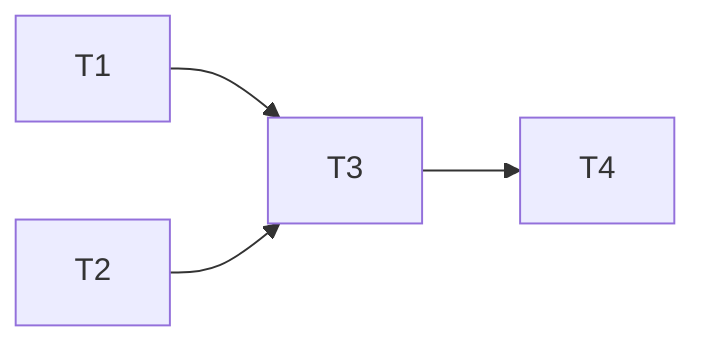

# Heartbeat Concurrency — Implementation Tasks

### Dependency Graph



T1 and T2 are independent and can run in parallel. T3 depends on both. T4 is verification.

---

## Task 1: Server — Add `heartbeat_concurrency` to `feature-settings.ts`

### What to build

Add a new feature setting registry entry for the concurrency level. This makes the setting available in the Settings UI and through `getFeatureSetting()`.

### Exact changes

**File**: `server/src/services/feature-settings.ts`

Find the `REGISTRY` array and add a new entry in the `Resilience` group, after `heartbeat_auto_disable_pct` (~L140). Insert before the `Sessions` group comment:

```typescript
  {
    key: 'heartbeat_concurrency',
    label: 'Heartbeat Concurrency',
    description:
      'Maximum number of concurrent heartbeat ping requests. Higher values complete cycles faster but may cause burst-rate-limit issues with less forgiving providers. Default is 4 — a safe middle ground. Set to 1 to restore sequential behavior.',
    type: 'number',
    default: 4,
    min: 1,
    max: 16,
    envVar: 'HEARTBEAT_CONCURRENCY',
    effect: 'restart',
    group: 'Resilience',
  },
```

### Verification

```typescript
expect(getFeatureSetting('heartbeat_concurrency')).toBe(4);

process.env.HEARTBEAT_CONCURRENCY = '8';
resetHeartbeatConfig(); // clear cache
expect(getFeatureSetting('heartbeat_concurrency')).toBe(8);

// Clamping:
process.env.HEARTBEAT_CONCURRENCY = '20'; // above max
expect(getFeatureSetting('heartbeat_concurrency')).toBe(16); // clamped
```

---

## Task 2: Server — Export `getHeartbeatConcurrency()` from `heartbeat.ts` (optional)

### What to build

If tests need to read the concurrency value directly (rather than calling `readConfig()` which is private), add a small accessor. This is only needed if the test suite verifies concurrency behavior in isolation.

### Exact changes

**File**: `server/src/services/heartbeat.ts`

```typescript
export function getHeartbeatConcurrency(): number {
  return readConfig().concurrency;
}
```

---

## Task 3: Server — Replace sequential ping loop with concurrent batches in `heartbeat.ts`

### What to build

Modify two parts of `heartbeat.ts`: (a) `readConfig()` to read and cache the concurrency setting, (b) `runCycle()` to replace the staggered ping loop with batched `Promise.allSettled`.

### Exact changes

**File**: `server/src/services/heartbeat.ts`

**3a.** Add module-level `_concurrency` variable near L92:

```typescript
let _staggerMs: number | null = null;
let _concurrency: number | null = null;  // NEW
```

**3b.** Modify `readConfig()` to read and return concurrency:

```typescript
function readConfig() {
  if (_enabled === null) {
    _enabled = getFeatureSetting('heartbeat_enabled') as boolean;
    _intervalMs = (getFeatureSetting('heartbeat_interval_min') as number) * 60 * 1000;
    _activityWindowMs = (getFeatureSetting('heartbeat_activity_window_min') as number) * 60 * 1000;
    _pingTimeoutMs = getFeatureSetting('heartbeat_timeout_ms') as number;
    _staggerMs = getFeatureSetting('heartbeat_stagger_ms') as number;
    _concurrency = getFeatureSetting('heartbeat_concurrency') as number;  // NEW
  }
  return {
    enabled: _enabled, intervalMs: _intervalMs!, activityWindowMs: _activityWindowMs!,
    pingTimeoutMs: _pingTimeoutMs!, staggerMs: _staggerMs!,
    concurrency: _concurrency!,  // NEW
  };
}
```

**3c.** Add `_concurrency = null` to `resetHeartbeatConfig()` (L110-116):

```typescript
export function resetHeartbeatConfig(): void {
  _enabled = null;
  _intervalMs = null;
  _activityWindowMs = null;
  _pingTimeoutMs = null;
  _staggerMs = null;
  _concurrency = null;  // NEW
}
```

**3d.** Replace the ping loop in `runCycle()` (L239-250). Current code:

```typescript
    // ── Ping each key (staggered) ──
    for (let i = 0; i < pingTasks.length; i++) {
      const task = pingTasks[i];
      try {
        await pingKey(task.platform, task.modelDbId, task.modelId, task.key, pingTimeoutMs);
      } catch (e) {
        console.error(`[Heartbeat] Ping error for key#${task.key.id} on ${task.platform}/${task.modelId}:`, e);
      }
      if (staggerMs > 0 && i < pingTasks.length - 1) {
        await sleep(staggerMs);
      }
    }
```

Replace with:

```typescript
    // ── Ping each key (concurrent batches) ──
    const { concurrency, staggerMs, pingTimeoutMs } = readConfig();
    for (let i = 0; i < pingTasks.length; i += concurrency) {
      const batch = pingTasks.slice(i, i + concurrency);
      await Promise.allSettled(batch.map(task =>
        pingKey(task.platform, task.modelDbId, task.modelId, task.key, pingTimeoutMs)
          .catch(err => {
            console.error(`[Heartbeat] Ping error for key#${task.key.id} on ${task.platform}/${task.modelId}:`, err);
          })
      ));
      if (concurrency === 1 && staggerMs > 0 && i + concurrency < pingTasks.length) {
        await sleep(staggerMs);
      }
    }
```

**3e.** Remove unused `staggerMs` destructure from L174 since `readConfig()` is called again inside the loop with `concurrency`. Keep the original destructure for the activity gate check:

```typescript
const { activityWindowMs, pingTimeoutMs } = readConfig();
// staggerMs is now only used inside the concurrent loop via concurrency logic
```

### Critical invariants

- `pingKey()` must NOT throw for `Promise.allSettled()` to complete — it uses internal try/catch. The `.catch()` on the map is a safety net.
- `seenKeys` dedup ensures each key is pinged exactly once per cycle, even with concurrency.
- `keyHealthMap.set()` is synchronous — no race condition on Map writes from concurrent pings.
- The `cycleInProgress` lock is still held during the entire concurrent cycle (unchanged).

### Verification

```typescript
// Unit test: runCycle with concurrency=4 fires all pings
const mockPing = vi.spyOn(heartbeat, 'pingKey').mockResolvedValue(undefined);
await runCycle(true);
expect(mockPing).toHaveBeenCalledTimes(seenKeys.size);

// Unit test: total cycle time ≤ batchCount × pingTimeoutMs
// (not keys × pingTimeoutMs)
const start = Date.now();
await runCycle(true);
const elapsed = Date.now() - start;
const batchCount = Math.ceil(pingTaskCount / 4);
expect(elapsed).toBeLessThan(batchCount * 11000); // 10s timeout + buffer

// Unit test: concurrency=1 with staggerMs=2000 behaves sequentially
// (stagger applied between each ping)
```

---

## Task 4: Run existing test suite to verify no regressions

### What to do

After Tasks 1-3 are complete, run:

```bash
npm run test -w server
npm run test -w client
```

### Verify

- All existing tests pass (especially `heartbeat.test.ts`, `routing-exhaustion.test.ts`)
- New concurrency tests pass
- Client typecheck passes
- No TypeScript compilation errors

### Expected failures

None. The concurrency change:
- Only modifies the ping scheduling within `runCycle()`
- All exports, types, and interfaces remain identical
- No new events, no new DB state, no client changes

---

## Implementation Summary

| Task | File | Change Type | Lines |
|---|---|---|---|
| 1 | `server/src/services/feature-settings.ts` | New registry entry | +14 |
| 2 | `server/src/services/heartbeat.ts` | Optional accessor export | +3 |
| 3a | `server/src/services/heartbeat.ts` | New `_concurrency` variable | +1 |
| 3b | `server/src/services/heartbeat.ts` | `readConfig()`: read + return concurrency | +3 |
| 3c | `server/src/services/heartbeat.ts` | `resetHeartbeatConfig()`: reset | +1 |
| 3d | `server/src/services/heartbeat.ts` | `runCycle()`: replace ping loop | ~10 |
| 4 | — | Run test suite | — |

**Total new code**: ~30 lines across 2 files. Zero new DB columns, zero new events, zero new schemas.
