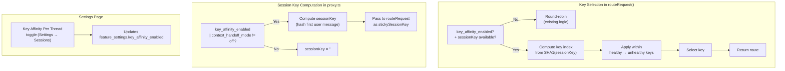

# Key Affinity Per Thread — Design Document

## 1. Architecture Overview



## 2. Component Changes

### 2.1 `server/src/services/router.ts` (Key Selection)

**Modification to `routeRequest()` function:**

```typescript
// Inside routeRequest(), after getting the sortedChain and before the key loop:
const { key_affinity_enabled } = getFeatureSettings();
const stickySessionKey = options?.stickySessionKey;

let keyOrder: KeyRow[];
let idx: number;

if (key_affinity_enabled && stickySessionKey) {
  // Affinity path: compute deterministic index
  const healthyKeys = keys.filter(k => isKeyHealthy(k.id));
  const unhealthyKeys = keys.filter(k => !isKeyHealthy(k.id));

  const hash = crypto.createHash('sha1').update(stickySessionKey).digest();
  const hashInt = hash.readUInt32BE(0);
  const totalKeys = healthyKeys.length + unhealthyKeys.length;

  // Compute combined index: healthy first, then unhealthy
  const combinedKeys = [...healthyKeys, ...unhealthyKeys];
  const affinityIndex = hashInt % combinedKeys.length;

  keyOrder = combinedKeys;
  idx = affinityIndex;

  // Log affinity selection
  console.log(`[Proxy] Key affinity selected key ${combinedKeys[affinityIndex].id} for session ${stickySessionKey.slice(0, 8)}`);
  publish({
    type: 'routing.key_affinity_selected',
    sessionKey: stickySessionKey.slice(0, 8),
    keyId: combinedKeys[affinityIndex].id,
    model: entry.model_id,
    at: Date.now(),
  });
} else {
  // Existing round-robin path (unchanged)
  const rrKey = `${entry.platform}:${entry.model_id}`;
  const rrIdx = roundRobinIndex.get(rrKey) ?? 0;
  const healthyKeys = keys.filter(k => isKeyHealthy(k.id));
  const unhealthyKeys = keys.filter(k => !isKeyHealthy(k.id));

  const hOffset = healthyKeys.length > 0 ? rrIdx % healthyKeys.length : 0;
  const uOffset = unhealthyKeys.length > 0 ? rrIdx % unhealthyKeys.length : 0;

  keyOrder = [
    ...healthyKeys.slice(hOffset),
    ...healthyKeys.slice(0, hOffset),
    ...unhealthyKeys.slice(uOffset),
    ...unhealthyKeys.slice(0, uOffset),
  ];
  idx = 0;
}

// Continue with existing key loop (L671-737)
```

**Key changes:**
- Adds deterministic key selection when affinity is enabled
- Preserves existing round-robin for non-affinity cases
- Publishes SSE event for observability

### 2.2 `server/src/routes/proxy.ts` (Session Key Decoupling)

**Modification to session key computation:**

```typescript
// Inside the request handler, where sessionKey is computed:
const handoffMode = isAutoRouted ? getContextHandoffMode() : ('off' as const);
const keyAffinityEnabled = getFeatureSetting('key_affinity_enabled') as boolean;

// Decoupled session key computation
const sessionKey = (keyAffinityEnabled || handoffMode !== 'off') 
  ? getSessionKey(messages, sessionIdHeader) 
  : '';

// Pass to routeRequest as before
const route = routeRequest(
  routingEstimate, 
  skipKeys, 
  preferredModel, 
  hasImage, 
  wantsTools, 
  skipModels, 
  { pinMode: isPinned, stickySessionKey: sessionKey || undefined },
);
```

**Key change:** Session key is computed if EITHER key affinity OR context handoff is enabled.

### 2.3 `server/src/services/feature-settings.ts` (New Setting)

**Add to `REGISTRY` array:**

```typescript
{
  key: 'key_affinity_enabled',
  label: 'Key Affinity Per Thread',
  description: 'Route all requests in the same conversation thread (identified by the first message) to the same API key. Maximizes upstream KV-cache reuse for cache-heavy providers. When disabled, keys are rotated round-robin.',
  type: 'boolean',
  default: false,
  envVar: 'KEY_AFFINITY_ENABLED',
  effect: 'live',
  group: 'Sessions',
},
```

### 2.4 Client Settings Page (`client/src/pages/SettingsPage.tsx`)

**Add to Sessions group:**

```tsx
// Inside the Sessions settings section:
<ToggleSetting
  title="Key Affinity Per Thread"
  description="Route all requests in the same conversation thread to the same API key. Maximizes cache reuse. Works independently of Context Handoff."
  settingKey="key_affinity_enabled"
  currentValue={settings.key_affinity_enabled}
  onChange={(value) => onChange('key_affinity_enabled', value)}
/>
```

## 3. Data Flow Changes

1. **Settings Page Toggle** → Updates `feature_settings` table → `key_affinity_enabled` is live-reloaded
2. **Request Handling** → `proxy.ts` computes `sessionKey` based on new decoupled logic
3. **Key Selection** → `router.ts` uses `sessionKey` and `key_affinity_enabled` to choose key
4. **Observability** → SSE event published when affinity selects a key

## 4. Error Handling

- If a key becomes exhausted during an affinity session, the router skips it and selects the next key in the combined healthy+unhealthy list. The next request from the same thread re-hashes and may select the same key again (if it recovered) or a different key.
- Round-robin state (`roundRobinIndex`) is NOT advanced during affinity selections, preserving rotation for non-affinity traffic.

## 5. Backward Compatibility

- The per-provider `sticky_sessions_enabled` column remains but becomes a NO-OP when `key_affinity_enabled = true`. When `key_affinity_enabled = false`, it continues to work as before (only with context handoff enabled).
- All existing round-robin behavior is preserved when the new setting is disabled (default).