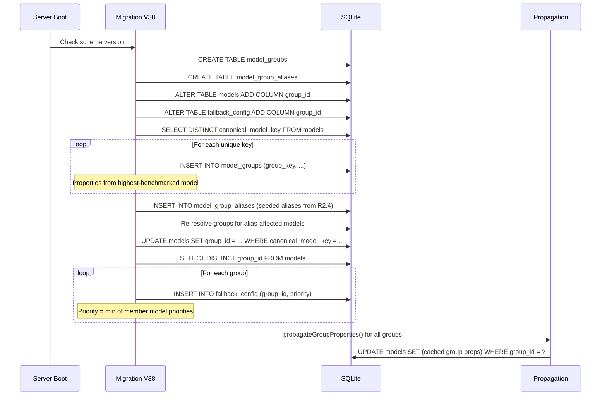

# Design — Model Grouping

---

## D1: Current Architecture (As-Is)

```
┌─────────────────────────────────────────────────────┐
│                     models                          │
│  id | platform | model_id | display_name |          │
│     | intelligence_rank | benchmark_score | ...     │
│     | canonical_model_key                            │
│                                                     │
│  UNIQUE(platform, model_id)                         │
└──────────┬──────────────────────────────────────────┘
           │
           ├── fallback_config (model_db_id → models.id)
           ├── requests (platform, model_id)
           ├── model_degradation (model_db_id)
           ├── benchmark writes (per model row)
           └── analytics (per platform, model_id)
```

**Problem**: `deepseek-v4-flash` from NV and `deepseek-v4-flash-free` from OpenCode Zen create two independent model rows. Each has its own intelligence score, its own fallback priority, its own degradation. The user sees two entries, the router treats them as unrelated.

---

## D2: Target Architecture (To-Be)

```
┌──────────────────────────────┐
│         model_groups         │
│  id | group_key              │
│     | display_name           │
│     | benchmark_score        │
│     | size_label             │
│     | intelligence_rank      │
│     | context_window         │
│     | supports_vision        │
│     | supports_tools         │
│     | enabled                │
└──────┬───────────────────────┘
       │ 1:N
┌──────┴──────────────────────────────────────┐
│                  models                      │
│  id | group_id (FK) | platform | model_id   │
│     | speed_rank | rpm_limit | enabled       │  ← provider-level only
│     | (denormalized cache of group props)    │
└──────┬───────────────────────────────────────┘
       │
       ├── model_group_aliases (alias → group_key)
       ├── fallback_config (group_id → model_groups.id)
       ├── requests (platform, model_id) — unchanged
       ├── model_degradation (model_db_id) — unchanged
       └── analytics (join via group_id for grouped queries)
```

**Key change**: The `models` table becomes a **provider realization table** — each row is "how provider X serves model Y." Group-level identity lives in `model_groups`.

---

## D3: DB Schema Changes

### D3.1 New table: `model_groups`

```sql
CREATE TABLE IF NOT EXISTS model_groups (
  id INTEGER PRIMARY KEY AUTOINCREMENT,
  group_key TEXT NOT NULL UNIQUE,
  display_name TEXT NOT NULL,
  benchmark_score REAL,
  aa_score REAL,
  aa_score_updated TEXT,
  aa_confidence REAL DEFAULT 1.0,
  swe_rebench_score REAL,
  swe_rebench_score_updated TEXT,
  swe_rebench_confidence REAL DEFAULT 1.0,
  nim_score REAL,
  nim_score_updated TEXT,
  nim_confidence REAL DEFAULT 1.0,
  nim_avg_response_ms REAL,
  nim_throughput_tps REAL,
  nim_uptime_pct REAL,
  benchmark_composite_version INTEGER,
  size_label TEXT NOT NULL DEFAULT '',
  intelligence_rank INTEGER,
  context_window INTEGER,
  max_output_tokens INTEGER,
  supports_vision INTEGER NOT NULL DEFAULT 0,
  supports_tools INTEGER NOT NULL DEFAULT 0,
  enabled INTEGER NOT NULL DEFAULT 1,
  created_at TEXT NOT NULL DEFAULT (datetime('now')),
  updated_at TEXT NOT NULL DEFAULT (datetime('now'))
);
CREATE UNIQUE INDEX IF NOT EXISTS idx_model_groups_key ON model_groups(group_key);
```

**Design note**: The per-source benchmark columns (`aa_score`, `swe_rebench_score`, `nim_score`, etc.) move here from `models`. Benchmark data is fundamentally a model property, not a provider property.

### D3.2 New table: `model_group_aliases`

```sql
CREATE TABLE IF NOT EXISTS model_group_aliases (
  id INTEGER PRIMARY KEY AUTOINCREMENT,
  alias TEXT NOT NULL UNIQUE,
  group_key TEXT NOT NULL,
  created_at TEXT NOT NULL DEFAULT (datetime('now'))
);
CREATE UNIQUE INDEX IF NOT EXISTS idx_model_group_aliases_alias ON model_group_aliases(alias);
```

### D3.3 Changes to `models` table

```sql
ALTER TABLE models ADD COLUMN group_id INTEGER REFERENCES model_groups(id);
```

**Denormalized cache columns** (intelligence_rank, benchmark_score, size_label, supports_vision, supports_tools, context_window, max_output_tokens) remain on `models`. They are populated from `model_groups` after any group-level property change. This preserves backward compatibility — existing code paths that read `models.benchmark_score` continue to work during incremental migration.

### D3.4 Changes to `fallback_config` table

```sql
ALTER TABLE fallback_config ADD COLUMN group_id INTEGER REFERENCES model_groups(id);
```

Both `model_db_id` and `group_id` coexist during migration. When grouping is enabled, the router uses `group_id`. When disabled (feature flag off), `model_db_id` is used.

### D3.5 Column migration map

| Column | Was on `models` | Moves to `model_groups` | Cached on `models`? |
|--------|-----------------|------------------------|---------------------|
| `benchmark_score` | ✅ | ✅ (source of truth) | ✅ |
| `aa_score` + `_updated` + `_confidence` | ✅ | ✅ (source of truth) | ✅ |
| `swe_rebench_score` + `_updated` + `_confidence` | ✅ | ✅ (source of truth) | ✅ |
| `nim_score` + `_updated` + `_confidence` + extras | ✅ | ✅ (source of truth) | ✅ |
| `benchmark_composite_version` | ✅ | ✅ (source of truth) | ✅ |
| `canonical_model_key` | ✅ | Stays on `models` | N/A (used for matching) |
| `display_name` | ✅ | ✅ (source of truth) | ✅ |
| `size_label` | ✅ | ✅ (source of truth) | ✅ |
| `intelligence_rank` | ✅ | ✅ (source of truth) | ✅ |
| `context_window` | ✅ | ✅ (source of truth) | ✅ |
| `max_output_tokens` | ✅ | ✅ (source of truth) | ✅ |
| `supports_vision` | ✅ | ✅ (source of truth) | ✅ |
| `supports_tools` | ✅ | ✅ (source of truth) | ✅ |
| `speed_rank` | ✅ | Stays on `models` | N/A (provider-dependent) |
| `rpm/rpd/tpm/tpd_limit` | ✅ | Stays on `models` | N/A (provider-dependent) |

---

## D4: Group Resolution Algorithm

The central function that determines which group a model belongs to:

```typescript
/**
 * Resolve a model_id to its group_key.
 * 1. Normalize model_id (lowercase, strip provider prefix, etc.)
 * 2. Check alias table for explicit override
 * 3. Fall back to canonicalizeModelId()
 */
async function resolveGroupKey(
  modelId: string,
  aliasCache: Map<string, string>
): string {
  const normalized = canonicalizeModelId(modelId);
  const aliasTarget = aliasCache.get(normalized);
  return aliasTarget ?? normalized;
}
```

**In-memory alias cache**: On startup, load all rows from `model_group_aliases` into a `Map<string, string>`. Invalidate on alias CRUD operations. This avoids a DB query per model resolution.

**Resolution flow**:

```
model_id: "opencode-zen/deepseek-v4-flash-free"
  │
  ├── canonicalizeModelId()
  │   strip provider prefix → "deepseek-v4-flash-free"
  │
  ├── alias cache lookup
  │   "deepseek-v4-flash-free" → "deepseek-v4-flash"  ✓
  │
  └── group_key = "deepseek-v4-flash"
      └── model_groups WHERE group_key = "deepseek-v4-flash"
```

---

## D5: Property Propagation

When group-level properties change (benchmark sync, operator edit), the new values must propagate to all member `models` rows.

```typescript
function propagateGroupProperties(db: Database, groupId: number): void {
  const group = db.prepare(
    'SELECT * FROM model_groups WHERE id = ?'
  ).get(groupId) as ModelGroup;

  db.prepare(`
    UPDATE models SET
      display_name = ?,
      benchmark_score = ?,
      intelligence_rank = ?,
      size_label = ?,
      context_window = ?,
      max_output_tokens = ?,
      supports_vision = ?,
      supports_tools = ?
    WHERE group_id = ?
  `).run(
    group.display_name,
    group.benchmark_score,
    group.intelligence_rank,
    group.size_label,
    group.context_window,
    group.max_output_tokens,
    group.supports_vision,
    group.supports_tools,
    groupId
  );
}
```

This runs:
- After `recomputeBenchmarkComposite()` updates `model_groups.benchmark_score`
- After operator edits group properties via the API
- After reconciliation (R3.5) when a model joins/leaves a group
- **Never in the hot path** — only during sync events, not during routing

---

## D6: Routing Algorithm — Group-Aware

### D6.1 Current flow (as-is)

```
fallback_config (priority order)
  → model_db_id 1 → score → try keys → fail
  → model_db_id 2 → score → try keys → fail
  → model_db_id 3 → score → try keys → success
```

Each model_db_id is a separate (platform, model_id) pair. Same model from two providers = two separate positions in the chain.

### D6.2 New flow (group-aware)

```
fallback_config (priority order)
  → group 1: [
      provider A (nim)      → sub-score → try keys → fail
      provider B (zen)      → sub-score → try keys → success  ✓
    ]
  → group 2: [
      provider C (groq)     → sub-score → try keys → success  ✓
    ]
```

The chain walks **groups**. Within a group, it tries all providers (in sub-score order) before moving to the next group. This means:

- **NV's DeepSeek V4 Flash** and **Zen's DeepSeek V4 Flash** share one chain position
- If NV is degraded but Zen is healthy, the request still succeeds **without falling through to the next group**
- The chain position reflects the model's importance (intelligence), not the provider's health

### D6.3 Implementation: `routeRequest()` changes

```typescript
function routeRequest(/* ... */): RouteResult {
  // 1. Get group-ordered chain
  const chain = db.prepare(`
    SELECT fc.group_id, fc.priority, fc.enabled,
           mg.group_key, mg.display_name,
           mg.benchmark_score, mg.intelligence_rank,
           mg.size_label, mg.context_window, mg.max_output_tokens,
           mg.supports_vision, mg.supports_tools
    FROM fallback_config fc
    JOIN model_groups mg ON mg.id = fc.group_id
    WHERE fc.enabled = 1 AND mg.enabled = 1
  `).all() as GroupChainRow[];

  // 2. For each group, load providers
  for (const group of sortedChain) {
    const providers = db.prepare(`
      SELECT m.id as model_db_id, m.platform, m.model_id, m.speed_rank,
             m.rpm_limit, m.rpd_limit, m.tpm_limit, m.tpd_limit,
             m.key_id, m.enabled, m.supports_vision, m.supports_tools
      FROM models m
      WHERE m.group_id = ? AND m.enabled = 1
    `).all(group.group_id) as ProviderRow[];

    // 3. Sub-score providers (speed + reliability + degradation only)
    const scored = providers
      .filter(p => hasKeys(p.platform))
      .map(p => ({ provider: p, score: providerScore(p) }))
      .sort((a, b) => b.score - a.score);

    // 4. Try providers in sub-score order
    for (const { provider } of scored) {
      const result = tryProvider(provider, group, keys, /* ... */);
      if (result) return result;
    }

    // 5. All providers in group exhausted → move to next group
  }

  throw new Error('All models exhausted');
}
```

### D6.4 `providerScore()` — Within-Group Scoring

Within a group, intelligence is constant. Scoring uses only:

```typescript
function providerScore(entry: ProviderRow): number {
  const speed = speedScore(entry.tokPerSec);
  const latency = latencyScore(entry.avgTtfbMs);
  const reliability = expectedReliability(entry.successes, entry.failures);
  const degradation = getDegradationFactor(entry.model_db_id);

  // Use the current strategy's weights but zero out intelligence
  const w = weightsFor(strategy);
  const effectiveIntelWeight = 0;
  const remaining = w.speed + w.reliability + w.latency;
  const renorm = remaining > 0 ? 1 / remaining : 1;

  return (
    speed * w.speed * renorm +
    reliability * w.reliability * renorm +
    latency * w.latency * renorm
  ) * degradation;
}
```

This re-normalizes the strategy weights after zeroing intelligence so speed/reliability/latency proportions stay consistent.

---

## D7: Chain Ordering — Group-Level Scoring

The **group's** position in the fallback chain is determined by its **best available provider's** full composite score:

```typescript
function groupRepresentativeScore(group: GroupChainRow, providers: ProviderRow[]): number {
  // Find the best-scoring provider (full composite, intelligence included)
  const scores = providers
    .filter(p => p.enabled && hasKeys(p.platform))
    .map(p => {
      const w = weightsFor(strategy);
      const intel = intelligenceComposite(group.sizeLabel, group.intelligenceRank, group.benchmarkScore);
      const speed = speedScore(p.tokPerSec);
      const latency = latencyScore(p.avgTtfbMs);
      const reliability = expectedReliability(p.successes, p.failures);
      const degradation = getDegradationFactor(p.model_db_id);
      return combineScore({ intel, speed, latency, reliability }, w) * degradation;
    });
  return Math.max(0, ...scores);  // best available provider = group's score
}
```

**If no provider has keys or is enabled**, the group's representative score is 0 — it effectively drops to the bottom of the chain.

---

## D8: Benchmark Pipeline — Group-Level Writes

### D8.1 AA Fetch

```typescript
// BEFORE (per-model):
db.prepare(`
  UPDATE models SET aa_score = ?, aa_score_updated = ?, aa_confidence = 1.0
  WHERE canonical_model_key = ?
`);

// AFTER (group-level):
db.prepare(`
  UPDATE model_groups SET aa_score = ?, aa_score_updated = ?, aa_confidence = 1.0
  WHERE group_key = ?
`);
// Then propagate to member models:
propagateGroupProperties(db, affectedGroupIds);
```

### D8.2 Composite Recomputation

```typescript
// BEFORE: reads per-model source scores, writes per-model benchmark_score
// AFTER: reads per-GROUP source scores, writes per-GROUP benchmark_score

function recomputeBenchmarkComposite(
  db: Database,
  affectedGroupIds: Set<number>,  // changed from model IDs to group IDs
  weights: Map<string, SourceWeight>,
): number {
  // ... same algorithm but reading from model_groups columns ...
  // ... writing benchmark_score to model_groups ...
  // ... then calling propagateGroupProperties() for each affected group ...
}
```

### D8.3 Static Fallback Table

`BENCHMARK_SCORES` in `benchmark-scores.ts` continues to serve as a cold-start fallback. `applyBenchmarkScores()` writes to `model_groups` instead of `models`, then propagates.

---

## D9: API Changes

### D9.1 `GET /api/models` — Grouped Response

Default (grouped):
```json
[
  {
    "groupId": 42,
    "groupKey": "deepseek-v4-flash",
    "displayName": "DeepSeek V4 Flash",
    "benchmarkScore": 55,
    "intelligenceRank": 46,
    "sizeLabel": "Frontier",
    "contextWindow": 131072,
    "supportsVision": true,
    "supportsTools": true,
    "enabled": true,
    "providers": [
      {
        "modelDbId": 101,
        "platform": "nim",
        "modelId": "nim/deepseek-v4-flash",
        "speedRank": 8,
        "rpmLimit": 30,
        "keyCount": 2,
        "enabled": true,
        "degradation": { "penalty": 0, "tier": "healthy" }
      },
      {
        "modelDbId": 207,
        "platform": "opencode-zen",
        "modelId": "opencode-zen/deepseek-v4-flash-free",
        "speedRank": 6,
        "rpmLimit": 10,
        "keyCount": 1,
        "enabled": true,
        "degradation": { "penalty": 3.5, "tier": "minor" }
      }
    ],
    "priority": 5,
    "fallbackEnabled": true
  }
]
```

Flat (`?flat=true`): same shape as today (backward compat).

### D9.2 `GET /api/models/groups` — Group Debug Map

```json
[
  {
    "groupKey": "deepseek-v4-flash",
    "groupId": 42,
    "memberCount": 2,
    "aliases": ["deepseek-v4-flash-free"],
    "providers": ["nim", "opencode-zen"]
  }
]
```

### D9.3 `POST /api/models/groups/aliases` — Manage Aliases

```json
// Request
{ "alias": "deepseek-v4-flash-fp8", "groupKey": "deepseek-v4-flash" }

// Response
{ "ok": true, "reassignedModels": 1 }
```

### D9.4 `DELETE /api/models/groups/aliases/:alias`

Removes the alias. Models previously grouped via this alias fall back to `canonicalizeModelId()` resolution on next reconciliation.

### D9.5 `PATCH /api/models/groups/:groupKey` — Edit Group Properties

```json
// Request
{ "displayName": "DeepSeek V4 Flash", "enabled": true }

// Response
{ "ok": true, "propagatedToModels": 2 }
```

### D9.6 `GET /api/fallback/routing` — Grouped Scores

```json
[
  {
    "groupKey": "deepseek-v4-flash",
    "groupId": 42,
    "groupScore": 3850,
    "providers": [
      { "platform": "nim", "subScore": 4200, "degradation": { "penalty": 0, "tier": "healthy" } },
      { "platform": "opencode-zen", "subScore": 3100, "degradation": { "penalty": 3.5, "tier": "minor" } }
    ]
  }
]
```

---

## D10: Migration Sequence



---

## D11: Feature Flag Gating

The `model_grouping_enabled` setting in the `settings` table controls whether the new routing path is active.

| Flag | Router Behavior | API Behavior |
|------|----------------|--------------|
| `false` (default during rollout) | Uses `fallback_config.model_db_id` (unchanged) | `GET /api/models` returns flat by default |
| `true` | Uses `fallback_config.group_id` (group-aware) | `GET /api/models` returns grouped by default |

This allows the migration to land without immediately changing routing behavior. The operator can flip the flag after verifying the group map looks correct.

---

## D12: Property Disagreement Resolution

When two providers report different values for a group-level property:

| Property | Strategy | Rationale |
|----------|----------|-----------|
| `context_window` | `MAX()` | Larger window is more capable; provider reporting smaller may have incomplete data |
| `max_output_tokens` | `MAX()` | Same reasoning |
| `supports_vision` | `OR` | If any provider supports it, the model does |
| `supports_tools` | `OR` | Same |
| `display_name` | First-created | Stability; renaming via API |
| `benchmark_score` | Benchmark pipeline | Always computed from authoritative sources, never taken from provider data |
| `size_label` | `MAX()` tier | Derived from benchmark_score when available; otherwise take highest tier reported |

---

## D13: Edge Cases

### D13.1 Provider advertises different model under same name
If "Groq's gpt-4o" is actually a different quantization than "OpenAI's gpt-4o", the alias table should NOT map them to the same group — they're different models despite the name. Operators can create separate groups with descriptive keys (`gpt-4o-groq-quantized`).

### D13.2 Model removed from one provider but still on another
The model row stays in `models` (disabled or archived by auto-sync). The group persists as long as at least one provider has the model enabled. If the last provider removes it, the group becomes empty and is cleaned up on next reconciliation.

### D13.3 Provider returns 404 on a model that other providers still serve
This creates a failure on one provider's model row. Degradation penalizes that provider. The router skips that provider and uses other providers in the same group. **No fallback to next group needed** — the group still has healthy providers.

### D13.4 Circular alias chain
Forbidden by validation: `POST /api/models/groups/aliases` rejects any alias that would create a cycle (alias A → B → A). This is checked by walking the alias chain during insert.

### D13.5 Custom model with no canonical match
Creates a new standalone group — no other provider offers this model. Zero overhead.

---

## D14: File Map

| File | Change |
|------|--------|
| `server/src/db/migrations.ts` | V38 migration (model_groups, aliases, group_id columns) |
| `server/src/db/model-groups.ts` | **NEW**: group CRUD, resolution, propagation |
| `server/src/db/benchmark-scores.ts` | Read/write benchmark data from model_groups |
| `server/src/services/router.ts` | Group-aware routeRequest(), providerScore() |
| `server/src/services/scoring.ts` | Add provider-only scoring mode |
| `server/src/services/benchmarks.ts` | Write AA/SWE/NIM scores to model_groups |
| `server/src/routes/models.ts` | Grouped + flat API responses |
| `server/src/routes/fallback.ts` | Grouped routing scores, group-level chain |
| `server/src/routes/proxy.ts` | Group-aware model resolution for pinning |
| `server/src/routes/analytics.ts` | `?groupBy=model` aggregation |
| `client/src/pages/FallbackPage.tsx` | Grouped model cards UI |
| `client/src/components/model-search-box.tsx` | Group-based search |
| `shared/types.ts` | ModelGroup type definitions |
