# Phantom Exhaustion Fix — Design Document

## 1. Architecture Overview

```mermaid
flowchart TD
    subgraph "RC-1 Fix: Error-status recovery"
        A["health.ts sets status='error'<br/>on transport error"] --> B{"Router+Heartbeat<br/>include 'error' in<br/>status filter?"}
        B -->|Current: No| C["Key invisible → model exhausted ❌"]
        B -->|Fix: Yes| D["Key still routable ✅<br/>heartbeat can self-heal"]
    end

    subgraph "RC-2 Fix: Group-aware round-robin"
        E["keys sorted healthy-first<br/>[H1, H2, U1, U2]"] --> F{"Round-robin applied<br/>per-group?"}
        F -->|Current: flat offset| G["idx=2 → U1 first ❌"]
        F -->|Fix: per-group offset| H["healthy group tried first,<br/>round-robin within group ✅"]
    end

    subgraph "RC-3 Fix: Model-scoped health"
        I["Heartbeat pings key,<br/>model 403s"] --> J{"Mark key globally<br/>unhealthy?"}
        J -->|Current: yes| K["Key penalized for ALL models ❌"]
        J -->|Fix: no — skip model-specific| L["Key stays healthy ✅<br/>only real failures penalize"]
    end

    subgraph "RC-4 Fix: Exhaustion TTL"
        M["markExhausted(keyId)"] --> N{"Entry has TTL?"}
        N -->|Current: no| O["Stale entries forever"]
        N -->|Fix: expire after cooldown| P["Periodic sweep clears<br/>stale entries ✅"]
    end
```



## 2. Fix Details

### Fix 1: Include `'error'` status in router and heartbeat key queries (RC-1)

**Principle:** A `status = 'error'` key is merely "health uncertain" — it failed a transport-level check, not an auth check. Treating it the same as `'unknown'` (which already passes the filter) is correct: route to it, and let actual request failures determine whether it's truly broken.

**Changes:**

| File | Current | New |
|------|---------|-----|
| `server/src/services/router.ts` L584 | `status IN ('healthy', 'unknown')` | `status IN ('healthy', 'unknown', 'error')` |
| `server/src/services/heartbeat.ts` L163 | `status IN ('healthy', 'unknown')` | `status IN ('healthy', 'unknown', 'error')` |
| `server/src/services/key-exhaustion.ts` L94, L105 | `status IN ('healthy', 'unknown')` | `status IN ('healthy', 'unknown', 'error')` |

**Why this is safe:**
- `'error'` is only set on **transport errors** (timeout/DNS/TLS), never on confirmed invalid keys
- Invalid keys get `status = 'invalid'` and `enabled = 0` (after 3 consecutive failures) — those stay excluded
- Including `'error'` keys means they get real traffic, which either succeeds (clearing exhaustion, flipping health) or fails normally (handled by existing retry/exhaustion logic)
- The heartbeat now **can** ping `'error'` keys, so it will flip them back to `'healthy'` on success — self-healing instead of dead zone

**Risk:** An `'error'` key that is truly broken (not just transport-flaky) will receive one failed request before being exhausted. This is one extra failed attempt, which the retry loop absorbs. The alternative (current behavior) is the key being permanently invisible — far worse.

### Fix 2: Per-group round-robin preserves healthy-first guarantee (RC-2)

**Principle:** Apply round-robin within each health group separately, then concatenate healthy-first. This preserves both the healthy-first guarantee and fair rotation within each group.

**Changes in `server/src/services/router.ts`:**

Replace the current sort-then-offset pattern (L608-634) with:

```typescript
// Split keys by health status
const healthyKeys = keys.filter(k => isKeyHealthy(k.id));
const unhealthyKeys = keys.filter(k => !isKeyHealthy(k.id));

// Apply round-robin offset WITHIN each group independently
const rrIdx = roundRobinIndex.get(rrKey) ?? 0;
const hOffset = healthyKeys.length > 0 ? rrIdx % healthyKeys.length : 0;
const uOffset = unhealthyKeys.length > 0 ? rrIdx % unhealthyKeys.length : 0;

const keyOrder = [
  ...healthyKeys.slice(hOffset),
  ...healthyKeys.slice(0, hOffset),
  ...unhealthyKeys.slice(uOffset),
  ...unhealthyKeys.slice(0, uOffset),
];

// Sticky session override (unchanged logic, applied to keyOrder)
let idx: number;
if (stickyEnabled && options?.stickySessionKey) {
  const hash = crypto.createHash('sha1').update(options.stickySessionKey).digest();
  const hashInt = hash.readUInt32BE(0);
  idx = hashInt % keyOrder.length;
} else {
  idx = 0; // start from beginning of keyOrder (healthy-first)
}

for (let attempt = 0; attempt < keyOrder.length; attempt++) {
  const key = keyOrder[(idx + attempt) % keyOrder.length];
  // ... rest unchanged
}
```

**Why this is safe:**
- Healthy keys are always tried first — the guarantee holds regardless of `rrIdx`
- Round-robin still distributes load within each health group
- Unhealthy keys still get tried (not removed) — just after healthy ones
- Sticky sessions still work (hash-based index into the concatenated array)

### Fix 3: Model-specific errors don't poison global key health (RC-3)

**Principle:** A 403 "model not on this tier" or 404 "model not found" says nothing about the key's validity — only about that specific key+model combination. The heartbeat should not penalize the key globally for these errors.

**Changes in `server/src/services/heartbeat.ts`:**

In `pingKey()` error handler (L237-270), add model-specific error detection before updating health:

```typescript
} catch (err: any) {
  const latencyMs = Date.now() - start;
  const tier = classifyError(err);

  // Model-specific errors (403/404) mean the key is valid but this model
  // isn't available on its tier. Don't penalize the key's global health.
  const isModelError = err?.status === 403 || err?.status === 404
    || /forbidden|not found|no endpoints found/i.test(err?.message ?? '');

  if (!isModelError) {
    // Update per-key health only for genuine failures
    const prev = keyHealthMap.get(keyRow.id);
    const newPenalty = (prev?.penalty ?? 0) + 1;
    keyHealthMap.set(keyRow.id, {
      penalty: newPenalty,
      lastPingAt: Date.now(),
      healthy: false,
      lastError: (err?.message ?? 'unknown').slice(0, 120),
    });
  }

  // Model-level degradation still records for retryable errors (5xx, 429)
  // but NOT for model-specific ones — those are config issues, not health
  if (tier === 'major') {
    recordFailure(modelDbId, 'major');
  } else if (tier === 'minor') {
    recordFailure(modelDbId, 'minor');
  }

  publish({
    type: 'heartbeat.ping',
    provider: platform,
    model: modelId,
    keyId: keyRow.id,
    success: false,
    latencyMs,
    error: (err?.message ?? 'unknown').slice(0, 120),
    at: Date.now(),
  });
}
```

**Why this is safe:**
- Real failures (5xx, timeouts, 429s) still penalize key health — those indicate key/provider problems
- 403/404 only skip key health penalty — they still publish the heartbeat event for observability and still record model-level degradation if tier warrants it
- The proxy's existing retry logic already handles 403/404 per-model (skipModels, isModelNotFoundError, isModelAccessForbiddenError)

### Fix 4: Exhaustion map TTL sweep (RC-4)

**Principle:** After a key's cooldown expires, its exhaustion entry is stale — the key should be considered available again. Add a periodic sweep that removes entries whose associated cooldown has expired.

**Changes in `server/src/services/key-exhaustion.ts`:**

Add a sweep function and interval:

```typescript
/** Remove exhaustion entries whose cooldown has expired. */
export function sweepStaleExhaustion(): number {
  let swept = 0;
  for (const [keyId, info] of exhaustionMap) {
    // Check if there's a non-expired cooldown for this key+model.
    // If the cooldown expired (or was never set in DB), the exhaustion is stale.
    const db = getDb();
    const row = db.prepare(`
      SELECT 1 FROM rate_limit_cooldowns
      WHERE key_id = ? AND model_id = ? AND expires_at_ms > ?
    `).get(keyId, info.modelId, Date.now()) as { 1: number } | undefined;

    if (!row) {
      exhaustionMap.delete(keyId);
      swept++;
    }
  }
  return swept;
}
```

Call from the existing health checker interval (or a dedicated 60s interval). Integration point: `server/src/index.ts` — add a `setInterval` that calls `sweepStaleExhaustion()` every 60 seconds.

**Why this is safe:**
- Only removes entries when the corresponding cooldown has expired in the DB — meaning the backoff period is over
- If a key is still on cooldown, the entry stays (correct — the key shouldn't be considered available yet)
- The router doesn't currently gate on `isExhausted()`, so this is purely housekeeping — but it prevents stale state from misleading dashboard consumers and future code paths

## 3. Migration Safety

All four fixes are **code-only** — no DB schema changes, no new tables, no migrations. The changes modify SQL `WHERE` clauses, JavaScript logic, and add a periodic sweep. Rolling back any fix independently is safe.

## 4. Testing Strategy

| Fix | Test Cases |
|-----|------------|
| Fix 1 | 1. Set a key to `status = 'error'` → verify router still selects it<br/>2. Set a key to `status = 'invalid'` → verify router excludes it<br/>3. Transport error in health check → key stays routable, heartbeat can self-heal |
| Fix 2 | 1. 2 healthy + 2 unhealthy keys, `rrIdx = 0` → H1, H2, U1, U2<br/>2. Same, `rrIdx = 1` → H2, H1, U2, U1 (rotated within groups)<br/>3. All keys healthy → round-robin distributes normally<br/>4. All keys unhealthy → round-robin distributes normally |
| Fix 3 | 1. Heartbeat ping returns 403 → key stays healthy in `keyHealthMap`<br/>2. Heartbeat ping returns 500 → key marked unhealthy<br/>3. Heartbeat ping returns 429 → key marked unhealthy |
| Fix 4 | 1. Mark key exhausted + set 90s cooldown → wait 91s → sweep removes entry<br/>2. Mark key exhausted + set 24h cooldown → sweep does NOT remove entry |
